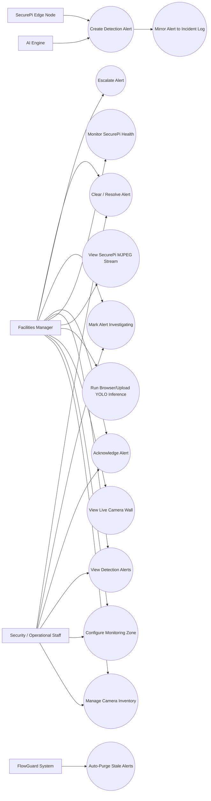

# FlowGuard — Object Detection / SecurePi Use-Case Documentation

Scope: this document describes the **implemented** Object Detection and SecurePi workflow only — camera inventory management, live camera/AI-inference viewing, zone-based detection configuration, and the unattended-object alert lifecycle (creation via AI engine or SecurePi edge device, review, and resolution by Facilities Managers/Staff). It was re-audited against the frontend pages, route guards, backend routes/middleware, and SecurePi edge scripts on 2026-07-28, branch `feature/facial-smart-logistics`. No feature or actor is included unless it is traceable to code.

---

## 1. System Scope

The feature spans three cooperating subsystems:

1. **FlowGuard web app (React frontend + Express/Sequelize backend)** — lets Facilities Managers configure cameras and monitoring zones, view live feeds with AI bounding-box overlays, and manage detection alerts through a status lifecycle.
2. **Python AI engine** — a private service reached through Node's authenticated `/api/yolo/people-count` and `/api/yolo/analyze-frame` proxies for browser/uploaded-video inference; it can also create alerts server-to-server via a shared service key.
3. **SecurePi edge node (Raspberry Pi + IMX500)** — runs local object detection on-device, exposes an MJPEG video stream and a health endpoint, tracks unattended packages against nearby people, and pushes alerts to FlowGuard over HTTP when an object is judged unattended.

Out of scope: facial recognition, attendance, booking, chat, and every other FlowGuard module not touching Camera/MonitoringZone/DetectionAlert/IncidentLog data or the pages listed above.

## 2. Actor Descriptions

Only actors backed by actual code (role constants, middleware checks, or a distinct calling identity) are included.

| Actor | Backed by | Description |
|---|---|---|
| **Facilities Manager (FM)** | `ROLES.FM` (`client/src/constants/roles.js`, `server/middlewares/auth.js`) | Highest internal access. Only role permitted on `/cameras` and `/object-detection`; can also use `/camera-inventory` and `/detection-settings`. Full CRUD on cameras, zones, and alert status transitions. |
| **Security/Operational Staff** | `ROLES.STAFF` | Can view and act on `/camera-inventory` (read-only in the UI) and `/detection-settings`, and can view + transition `DetectionAlert.status` via the API (`requireRole('FM','Staff')`). Has no route access to `/cameras` or `/object-detection` (blocked by `ACCESS.FM_ONLY` route guards) and no nav link to any of these pages in the sidebar. |
| **Tenant** | `ROLES.TENANT` | Explicitly excluded from every Camera/Zone/DetectionAlert route and page in this feature (`ACCESS.FM_ONLY` / `ACCESS.FM_STAFF` never include `TENANT`); confirmed blocked (403) from alert status changes in `server/tests/.../detection-alerts.test.js`. |
| **AI Engine (Python YOLO service)** | `verifyServiceOrRole` + `x-service-key` header matched against `AI_SERVICE_KEY` (`server/middlewares/auth.js`) | A trusted private service that can create `DetectionAlert` rows via `POST /api/detection-alerts` without a user JWT. Browser people-count and frame-analysis calls first pass through Node JWT/RBAC, Google ID-token, and service-key handling. |
| **SecurePi Edge Node** | Bearer token compared to `EDGE_INGEST_TOKEN` (`server/routes/edgeDetectionAlerts.js` lines 35-45) | A physical/simulated Raspberry Pi + IMX500 device that performs its own on-device detection/tracking and pushes alerts to `POST /api/edge/detection-alerts` using a static shared bearer token distinct from the AI engine's service key. The separate `raspberry-pi/pi_camera_steam.py` camera node serves the MJPEG stream and `/health` endpoint that the FlowGuard frontend consumes directly (browser-to-Pi, not through the Node backend). |
| **Browser Camera User** | `sourceMode === 'camera'` in `ObjectDetection.jsx` | Not a distinct account/role — this is an FM user who selects the "Browser Camera" video source (their own device webcam via `getUserMedia`) instead of a hardware/SecurePi feed or an uploaded file. Included here only because the prompt's candidate actor list names it and it is a genuine, code-backed mode of interacting with the system, not because it is a separate authentication identity. |

**Actors explicitly not included** because nothing in the code supports them: "System Administrator" (no such role exists — the only roles are `FM`/`Staff`/`Tenant`, confirmed against `client/src/constants/roles.js` and the `User` model's `ENUM('FM','Tenant','Staff')`).

## 3. Use-Case Diagram

## 4. Use-Case Summary Table

| ID | Use Case | Primary Actor(s) | Page / Route |
|---|---|---|---|
| UC1 | Manage Camera Inventory (create, edit, deactivate) | FM (full), Staff (view-only) | `client/src/pages/CameraInventory.jsx` → `/api/cameras` |
| UC2 | Configure Monitoring Zone (thresholds, monitored classes, severity) | FM (full), Staff (route-permitted) | `client/src/pages/DetectionSettings` (route `/detection-settings`) → `/api/zones` |
| UC3 | View Live Camera Wall | FM only | `client/src/pages/Cameras.jsx` (`/cameras`) |
| UC4 | Run Browser/Upload YOLO Inference | FM only | `client/src/pages/ObjectDetection.jsx`, `CameraFeed.jsx` → Node `/api/yolo/*` → private FastAPI `/api/yolo/*` |
| UC5 | View SecurePi MJPEG Stream | FM only | `ObjectDetection.jsx` (hardware mode), `CameraFeed.jsx` → SecurePi `/video_feed` |
| UC6 | Monitor SecurePi Health | FM only | `ObjectDetection.jsx` → SecurePi `/health` |
| UC7 | Create Detection Alert | AI Engine, SecurePi Edge Node, (FM/Staff manual test alert) | `POST /api/detection-alerts`, `POST /api/edge/detection-alerts` |
| UC8 | View Detection Alerts | FM, Staff | `ObjectDetection.jsx`, `Cameras.jsx` → `GET /api/detection-alerts` |
| UC9 | Acknowledge Alert | FM, Staff | `PUT /api/detection-alerts/:id` |
| UC10 | Mark Alert Investigating | FM, Staff | `PUT /api/detection-alerts/:id` |
| UC11 | Escalate Alert | FM (UI only exposes this on `ObjectDetection.jsx`) | `PUT /api/detection-alerts/:id` |
| UC12 | Clear / Resolve Alert | FM, Staff | `PUT /api/detection-alerts/:id` |
| UC13 | Auto-Purge Stale Alerts | FlowGuard System (background job) | `server/routes/detectionAlerts.js` `purgeStaleLogs()` |
| UC14 | Create and link Incident Log | FlowGuard System (atomic side effect of UC7) | both alert-ingest routes create `IncidentLog`, then set `DetectionAlert.incident_log_id` in one transaction |

## 5. Detailed Use-Case Specifications

### UC1 — Manage Camera Inventory
- **Actors:** Facilities Manager (full), Staff (view-only)
- **Trigger:** FM opens `/camera-inventory` to add/edit/deactivate a camera.
- **Preconditions:** Actor is authenticated; `userRole` is `FM` or `Staff` (route allows `ACCESS.FM_STAFF`); for edit/delete, the target camera row exists.
- **Main flow:**
  1. Page loads camera list (`GET /api/cameras`) and zone list (`GET /api/zones`) for the zone-assignment dropdown.
  2. FM clicks "Add Camera" (auto-suggested next `CAM-NN` code) or "Edit" on an existing row.
  3. FM fills `camera_code`, `camera_name`, `location`, optional `zone_id`, `status`, a stream source (preset demo `.mp4` or a custom `http(s)://` URL intended for a SecurePi MJPEG endpoint), optional `camera_type`/`notes`.
  4. On Save, frontend sends `POST /api/cameras` (create) or `PUT /api/cameras/:id` (edit).
  5. Backend validates required fields, `status` enum, zone existence, and case-insensitive `camera_code` duplication before persisting.
- **Postconditions:** A `cameras` row is created/updated; `last_active_at` is stamped to the current time.
- **Alternate/Exception flows:**
  - Staff opens the same page: create/edit/delete controls are hidden entirely by the frontend (`canEdit` check), and a "view-only access" banner is shown — this is a UI-level restriction layered on top of the server allowing Staff read access.
  - Duplicate `camera_code` → `409` returned by the server; UI shows the error.
  - Custom stream URL not starting with `http://`/`https://` → blocked client-side before submission.
  - Non-existent `zone_id` submitted → `400` from server.
  - Delete: FM clicks Delete, must confirm a second time (`confirmDeleteId` two-click pattern); backend sets `status:'Disabled'` then soft-deletes (`paranoid` — row remains with `deletedAt` set).

### UC2 — Configure Monitoring Zone
- **Actors:** Facilities Manager (full), Staff (route-permitted; UI not inspected in this pass but route guard `ACCESS.FM_STAFF` matches Camera Inventory's pattern)
- **Trigger:** FM/Staff manages zone thresholds via the Detection Setup page (`/detection-settings`).
- **Preconditions:** Authenticated; role FM or Staff.
- **Main flow:** Create/update a `monitoring_zones` row: `zone_name`, `location`, `time_threshold` (legacy minutes, required), optionally `density_threshold`, `unattended_threshold_seconds`, `alert_cooldown_seconds`, `severity`, `assigned_team`, `detection_enabled`, `monitored_classes` (comma list or array, serialized to a JSON string).
- **Postconditions:** A `monitoring_zones` row is created/updated; `unattended_threshold_seconds`, when set, takes precedence over `time_threshold` in the AI engine's threshold logic.
- **Alternate/Exception flows:** Missing required fields, non-positive numeric thresholds, invalid `severity`, or an empty `monitored_classes` list after cleaning → `400` from `server/routes/zones.js`.

### UC3 — View Live Camera Wall
- **Actors:** Facilities Manager only (`ACCESS.FM_ONLY` on `/cameras`)
- **Trigger:** FM opens `/cameras` ("Camera Network").
- **Preconditions:** Authenticated; role FM.
- **Main flow:**
  1. Page loads the camera inventory and renders a `<CameraFeed>` tile per camera.
  2. A side panel polls `GET /api/detection-alerts` every 15s and lists active alerts with a one-click "Mark cleared" action (`PUT` status `Cleared`) for `Active` alerts.
  3. FM can select a feed for a detail view with quick links to "Manage" (Camera Inventory) and "Detection" (Object Detection page).
- **Postconditions:** No persistent state change from viewing; clearing an alert transitions its `status` to `Cleared`.

### UC4 — Run Browser/Upload YOLO Inference
- **Actors:** Facilities Manager only (`ACCESS.FM_ONLY` on `/object-detection`)
- **Trigger:** FM selects the "Browser Camera" or "Upload File" source mode on the Object Detection page.
- **Preconditions:** Authenticated; role FM; browser grants camera permission for the webcam mode.
- **Main flow:**
  1. Frontend captures a video frame every ~2.2s (Object Detection page) or 2s (`CameraFeed.jsx` tile), encodes it as a base64 JPEG data URL, and `POST`s to Node `/api/yolo/analyze-frame` with `{ image, source, camera_id?, zone_id? }` and the user JWT.
  2. AI engine returns bounding boxes/classes/confidences; frontend draws them, filtering by a confidence threshold per class (e.g. person ≥0.45, food_item ≥0.3) and a fixed allow-list of relevant classes.
  3. A separate authenticated poll to Node `/api/yolo/people-count` every 5s feeds the people-count state; Node calls private FastAPI.
- **Postconditions:** No database writes occur directly from this flow — it is a display-only inference loop; any resulting alert would come from the AI engine independently calling `POST /api/detection-alerts` (UC7), not from this analyze-frame call itself as inspected.
- **Exception flow:** After 3 consecutive `people-count` failures, the page shows an "AI engine offline" banner.

### UC5 — View SecurePi MJPEG Stream
- **Actors:** Facilities Manager only
- **Trigger:** FM selects "Hardware/SecurePi" as the video source on Object Detection (or a camera whose inventory `stream_url` is an `http(s)://.../video_feed` URL is shown on the Camera Wall/`CameraFeed.jsx`).
- **Preconditions:** A configured Pi camera endpoint must expose `GET /video_feed`. New deployments use the maintained FlowGuard Pi camera service (`raspberry-pi/pi_camera_steam.py`); the historical `edge/securepi/upstream/securePi.py` runtime exposes a compatible annotated stream for legacy installations. The frontend resolves the URL via `client/src/utils/securepiStream.js`.
- **Main flow:** Browser renders a plain `` tag pointed at the MJPEG endpoint — the browser natively decodes the `multipart/x-mixed-replace` stream frame-by-frame; no YOLO `analyze-frame` calls are made for this mode since annotation happens on-device.
- **Postconditions:** None (view-only). `hardwareStatus` UI state reflects `loading`/`live`/`error` based on the `` `onLoad`/`onError` events.
- **Exception flow:** On stream error, UI shows "SecurePi feed unavailable" and a "Reconnect SecurePi" button that forces a cache-busted reload.

### UC6 — Monitor SecurePi Health
- **Actors:** Facilities Manager only
- **Trigger:** Automatic, while the Object Detection page is open in hardware mode.
- **Main flow:** Frontend polls `GET <stream-origin>/health` every 10s. The maintained camera service returns operational camera status (`status`, `camera`, `targetFps`, `frameAgeMs`, and `sequence`); the historical all-in-one runtime returns its legacy online/stream status. The frontend relies only on HTTP success or failure.
- **Postconditions:** Drives a `securepi_edge_live`/`securepi_edge_offline` banner state; no data is persisted.

### UC7 — Create Detection Alert
- **Actors:** AI Engine (via service key), SecurePi Edge Node (via edge ingest token), or an FM/Staff user creating a manual test alert with their own JWT.
- **Trigger:** AI engine or SecurePi determines an object/person condition (e.g. unattended package) warrants an alert.
- **Preconditions (AI engine path, `POST /api/detection-alerts`):** caller supplies header `x-service-key` matching `AI_SERVICE_KEY`, **or** a valid FM/Staff JWT.
- **Preconditions (edge path, `POST /api/edge/detection-alerts`):** caller supplies `Authorization: Bearer <token>` matching `EDGE_INGEST_TOKEN`; this token is accepted **only** on the edge route, not on the normal `/api/detection-alerts` route (confirmed by test: reusing an edge token there yields 403, not 201).
- **Main flow:**
  1. Caller submits `zone_name`, `camera_location` (both required), and optional `status`, `object_class`, `duration_seconds`, `person_name`, `alert_type`, `severity`, `source`, `confidence`, `snapshot_url`/`snapshot_path`, `device_id`, `timestamp`/`occurred_at`.
  2. Server validates `status` (if given) against the fixed list and `severity` against `Low/Medium/High/Critical`.
  3. Server best-effort resolves `zone_id` (exact match on `MonitoringZone.zone_name`) and `camera_id` (exact match on `Camera.camera_name` or `Camera.location`) — leaves them `null` if no match.
  4. `DetectionAlert` row created (default `status:'Active'`, default `severity:'High'`; edge route additionally defaults `object_class`→`'package-like object'`, `alert_type`→`'Unattended Object'`, `source`→`'SecurePi Edge Node'`).
  5. Both standard and edge paths create a matching `IncidentLog` and set `DetectionAlert.incident_log_id` inside the same transaction.
- **Postconditions:** Linked `detection_alerts` and `incident_logs` rows; `201` returns the created alert. If either create/link step fails, the transaction rolls back.
- **Alternate/Exception flows:**
  - Missing `zone_name`/`camera_location` → `400`.
  - Invalid `status`/`severity` → `400`.
  - No/invalid service key or edge token → `401`; `EDGE_INGEST_TOKEN` not configured server-side → `503` (edge route only).
  - Unknown extra payload fields are silently dropped (whitelist-style field extraction), not persisted or rejected.

### UC8 — View Detection Alerts
- **Actors:** FM, Staff
- **Trigger:** Object Detection or Camera Wall page loads/polls.
- **Preconditions:** Authenticated; role FM or Staff (`requireRole('FM','Staff')`).
- **Main flow:** `GET /api/detection-alerts` returns up to 50 most recent alerts, optionally filtered by `status` query param, newest first.
- **Postconditions:** None (read-only).

### UC9 — Acknowledge Alert
- **Actors:** FM, Staff
- **Preconditions:** Alert exists and is currently `Active` (UI only enables the "Acknowledge" button in that state, though the API itself does not enforce a specific from-state).
- **Main flow:** `PUT /api/detection-alerts/:id` with `{status:'Acknowledged'}`.
- **Postconditions:** Alert `status` becomes `Acknowledged`.

### UC10 — Mark Alert Investigating
- **Actors:** FM, Staff
- **Main flow:** `PUT /api/detection-alerts/:id` with `{status:'Investigating'}`, triggered either from the lifecycle button or by clicking an alert row in the "Latest Detection Alerts" list.
- **Postconditions:** Alert `status` becomes `Investigating`.

### UC11 — Escalate Alert
- **Actors:** FM (this specific action button is only present on `ObjectDetection.jsx`, an FM-only page)
- **Main flow:** `PUT /api/detection-alerts/:id` with `{status:'Escalated'}`.
- **Postconditions:** Alert `status` becomes `Escalated`.
- **Note:** The API itself allows any FM/Staff caller to set any valid status via this same endpoint; the restriction to FM here reflects which page exposes the button, not a distinct server-side rule.

### UC12 — Clear / Resolve Alert
- **Actors:** FM, Staff
- **Main flow:** `PUT /api/detection-alerts/:id` with `{status:'Cleared'}` — available as "Mark Resolved" on Object Detection (always enabled) and "Mark cleared" on the Camera Wall (only shown for `Active` alerts).
- **Postconditions:** Alert `status` becomes `Cleared`.

### UC13 — Auto-Purge Stale Alerts
- **Actor:** FlowGuard System (background job, no human actor)
- **Trigger:** Runs 20s after server startup, then every 24 hours.
- **Main flow:** `DetectionAlert.destroy({ where: { createdAt: { [Op.lt]: now-30days } }, force: true })` — a **hard** delete (bypasses the `paranoid` soft-delete) of any alert older than 30 days regardless of its status.
- **Postconditions:** Matching rows are permanently removed; count logged to server console.

### UC14 — Create and link Incident Log
- **Actor:** FlowGuard System (side effect of either UC7 ingest path).
- **Trigger:** During `POST /api/detection-alerts` or `POST /api/edge/detection-alerts`.
- **Main flow:** Inside one managed transaction the server creates `DetectionAlert`, maps the detection/zone to an incident type, creates `IncidentLog`, and updates `DetectionAlert.incident_log_id` with the incident primary key.
- **Postconditions:** `detection_alerts.incident_log_id` links to `incident_logs.id`. Alert/incident status, severity, person, and soft deletion are synchronised by the respective update/delete routes.
- **Exception flow:** Any create/link failure returns 500 and rolls back the transaction; old rows predating the nullable link remain supported without synchronisation.

## 6. Alternate and Exception Flows (Cross-Cutting)

- **No/expired JWT** on any protected route → `401 "Access Denied. No security token provided."` (no token) or `403 "Invalid or expired security token."` (bad/expired token), from `verifyToken`.
- **Account deleted after token issuance** → `401 "Account no longer exists. Session terminated."` (server re-checks the DB on every request, not just the JWT payload).
- **Account suspended (`isActive:false`)** → `403 "Account suspended. Session terminated."`.
- **Session revoked** (password reset / suspension bumped `tokenVersion`) → `401 "Session revoked. Please log in again."`, even if the JWT itself hasn't expired.
- **Authenticated but wrong role** → `403 "Insufficient permissions for this resource."` from `requireRole`.
- **Frontend route-guard mismatch** (`ProtectedRoute.jsx`): no `accessToken` in `localStorage` → redirect to `/error/401`; role not in the page's `allowedRoles` → redirect to `/error/403`. This is a client-side convenience check only (reads `localStorage`, no signature verification) — the server-side checks above are the actual authorization boundary.
- **Sidebar visibility vs. route permission mismatch:** Staff is permitted by the route guard to open `/camera-inventory` and `/detection-settings` directly by URL, but the sidebar only renders links to Camera Inventory/Object Detection/etc. when `isFM` — so Staff has no in-app navigation entry point to the pages it's technically allowed to view.
- **SecurePi stream unreachable** → Object Detection/Camera Wall show a stream-error state ("SecurePi feed unavailable" / offline banner) rather than failing the page.

## 7. Business Rules

1. A camera's `status` must be one of `Online`, `Offline`, `Maintenance`, `Disabled` — enforced as a true Postgres ENUM plus a route-level check.
2. A `camera_code` must be unique, checked case-insensitively — but this is enforced only in application code (`server/routes/cameras.js`), not by a database constraint.
3. A `DetectionAlert.status` must be one of `Active`, `Acknowledged`, `Investigating`, `Dispatched`, `Escalated`, `Cleared` — enforced only in route code (the column itself is a plain string, unlike `Camera.status`).
4. `severity` (on both `DetectionAlert` and `MonitoringZone`) must be one of `Low`, `Medium`, `High`, `Critical` — a true ENUM at the DB level.
5. An `EDGE_INGEST_TOKEN` presented at `/api/edge/detection-alerts` cannot be reused to authenticate against `/api/detection-alerts` — the two ingestion paths use distinct secrets and distinct middleware.
6. Detection alerts older than 30 days are automatically and permanently purged, independent of their resolution status.
7. `zone_id`/`camera_id` on a `DetectionAlert` are never supplied by the caller — they are always resolved server-side by exact string match against existing zone/camera names, and remain `null` if no match is found; alert creation never fails because of an unresolved link.
8. `monitored_classes` on a `MonitoringZone` must contain at least one non-empty entry if the field is supplied at all.
9. `unattended_threshold_seconds`, when set on a zone, takes precedence over the legacy `time_threshold` (minutes) for the AI engine's unattended-object timing logic.
10. On the SecurePi upstream edge script, a bag is only "reset" (its unattended timer cleared) when its previously claimed owner returns within `person_proximity_px`; any other nearby person does not reset the timer. A repeat alert for the same bag is suppressed until `alert_cooldown_sec` has elapsed since the last alert for it.

## 8. Preconditions and Postconditions (Summary by Data Entity)

| Entity | Created by | Precondition to create | Postcondition |
|---|---|---|---|
| `cameras` row | FM via Camera Inventory | Unique `camera_code`; if `zone_id` given, zone must exist | Row persisted; `last_active_at` stamped |
| `monitoring_zones` row | FM/Staff via Detection Setup | `zone_name`, `location`, positive `time_threshold` required | Row persisted |
| `detection_alerts` row | AI Engine, SecurePi Edge Node, or FM/Staff manual call | Valid service key / edge token / JWT+role; `zone_name` and `camera_location` present; valid `status`/`severity` if given | Row persisted with `status` defaulting to `Active`; IDs best-effort resolved; `incident_log_id` links the atomically created incident |
| `incident_logs` row (Object-Detection-originated) | FlowGuard System, as a side effect of either alert path | Same transaction as DetectionAlert | Row persisted with mapped incident type and linked from `DetectionAlert.incident_log_id` |

## 9. Traceability to Pages, Routes, and Database Entities

| Page | Route(s) called | DB entities touched |
|---|---|---|
| `client/src/pages/CameraInventory.jsx` | `GET/POST/PUT /api/cameras`, `GET /api/zones` | `cameras`, `monitoring_zones` (read-only, for zone dropdown) |
| `client/src/pages/Cameras.jsx` | `GET /api/cameras` (implied inventory load), `GET/PUT /api/detection-alerts` | `cameras`, `detection_alerts` |
| `client/src/pages/ObjectDetection.jsx` | `GET /api/zones`, `GET /api/cameras`, `GET/PUT /api/detection-alerts`, Node `/api/yolo/people-count` + `/api/yolo/analyze-frame`, SecurePi `/video_feed` + `/health` | `monitoring_zones`, `cameras`, `detection_alerts`, linked `incident_logs` |
| `client/src/pages/CameraFeed.jsx` (embedded in Cameras.jsx) | SecurePi `/video_feed` (hardware mode) or Node `/api/yolo/analyze-frame` (local video mode) | none directly |
| `server/routes/cameras.js` | — | `cameras`, `monitoring_zones` (existence check only) |
| `server/routes/zones.js` | — | `monitoring_zones` |
| `server/routes/detectionAlerts.js` | — | `detection_alerts`, `monitoring_zones`/`cameras` lookup, `incident_logs` atomic create/link and bidirectional sync |
| `server/routes/edgeDetectionAlerts.js` | — | `detection_alerts`, `monitoring_zones` (lookup), `cameras` (lookup) |
| `raspberry-pi/pi_camera_steam.py` | Serves `/video_feed`, `/snapshot`, and `/health` for direct browser-to-Pi camera access | none directly |
| `edge/securepi/repositories/SecurePi_FlowGuard-main/edge/securePi.py` | Runs on-device detection and calls FlowGuard `POST /api/edge/detection-alerts`; it does not provide the browser MJPEG server | `detection_alerts` (via the above route) |
| `edge/securepi/upstream/securePi.py` | Historical compatibility runtime with integrated annotated `/video_feed`, `/health`, and `/people-count`; not authoritative for new deployments | `detection_alerts` through its FlowGuard bridge |

## 10. Current Limitations

- **No admin/system-administrator role exists** — all access control collapses to the three roles `FM`/`Staff`/`Tenant`; there is no dedicated super-user or audit role for this feature.
- **Client-side route guarding (`ProtectedRoute.jsx`) trusts `localStorage` values with no signature check** — it is a UX convenience only; the real authorization boundary is entirely server-side (`verifyToken`/`requireRole`), which is correctly enforced independently.
- **Sidebar navigation and route permissions are inconsistent for Staff** — Staff can reach `/camera-inventory` and `/detection-settings` by direct URL but has no menu entry to them, which may confuse users about what they're allowed to do.
- **`DetectionAlert.incident_log_id` is nullable and not unique.** Current standard and edge ingestion create one linked alert/incident pair atomically, but older alerts can remain unlinked and the database does not enforce one-to-one cardinality.
- **Two independent implementations of alert validation/link-resolution logic** exist (`server/routes/detectionAlerts.js` and `server/routes/edgeDetectionAlerts.js`) — both now create/link incidents transactionally, but duplicated validation/default mapping can still drift.
- **Zone/camera link resolution for alerts depends on exact, case-sensitive string matches** against non-unique `zone_name`/`camera_name`/`location` fields — duplicate names can cause an alert to link to the wrong zone/camera, or none at all.
- **The fallback edge script (`edge/securepi/securepi_edge.py`) has no working OpenCV detector and no MJPEG/health server.** The bundled SecurePi_FlowGuard runtime provides on-device detection and alert ingestion, while the separate `raspberry-pi/pi_camera_steam.py` service provides the maintained browser MJPEG/health/snapshot endpoints; deployments that need both must run both components. The historical `edge/securepi/upstream/` runtime retains an all-in-one stream server for compatibility only.
- **No use-case in this system exposes camera-stream authentication** — the SecurePi `/video_feed` and `/health` endpoints are fetched directly by the browser with no token, relying solely on network placement/firewalling for protection.
- **The 30-day alert auto-purge (UC13) is unconditional** — it deletes alerts regardless of whether they were ever acknowledged/resolved, with no configurable retention policy in the code.
