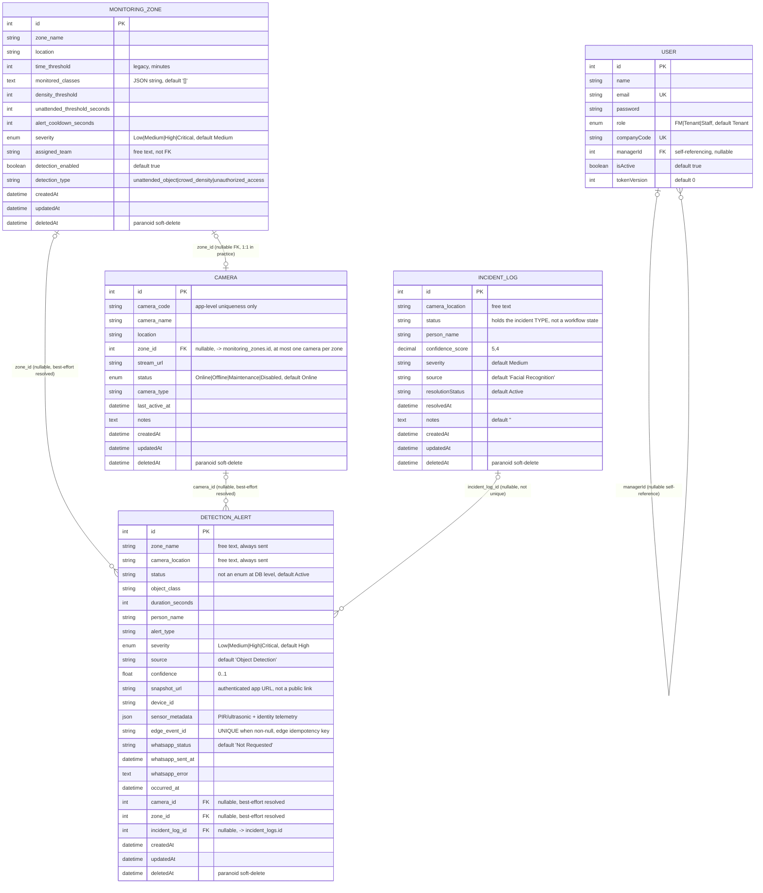

# FlowGuard — Object Detection / SecurePi Database Documentation

Scope: this document covers the database entities that back the **Object Detection** and **SecurePi** feature — `Camera`, `DetectionAlert`, `MonitoringZone`, `IncidentLog`, and the relevant ownership/audit fields on `User`. It was re-audited directly against the current models, routes, sync logic, migrations, seed data, and tests on 2026-08-09, branch `feature/object-detection-v2`. It does not cover unrelated domains (Attendance, Booking, ChatTranscript, KnowledgeBase, SupportTicket, SecurityLogs, Invite, Staff) except where `User` fields are shared infrastructure.

---

## 1. Database Overview

FlowGuard uses a single relational database to store facility-management data. For this feature area, four tables work together to support an edge-camera-driven detection pipeline:

- **`monitoring_zones`** — configurable physical/logical zones (e.g. "Loading Bay") with detection thresholds, a detection category, and severity defaults.
- **`cameras`** — camera inventory, each optionally assigned to a zone (at most one camera per zone, enforced in route code).
- **`detection_alerts`** — alerts raised by the Python AI engine, the browser Security Camera page, or a SecurePi edge device. Alerts carry free-text zone/camera identifiers, best-effort resolved foreign keys, an edge idempotency key, sensor telemetry, and notification-delivery state.
- **`incident_logs`** — a general incident ledger linked from object-detection alerts through nullable `detection_alerts.incident_log_id`.
- **`users`** — referenced only for authentication/role checks (`FM`, `Staff`, `Tenant`) that gate every route in this feature; no direct FK relationship to the four tables above.

Snapshot **images** are deliberately *not* stored in the database — only a URL pointing at the authenticated snapshot endpoint is (see §9).

## 2. Database Technology and ORM

- **Database:** PostgreSQL; the current cloud architecture targets Cloud SQL.
- **ORM:** Sequelize, using the `pg` driver. Dialect is hardcoded as `'postgres'` in `server/models/index.js` — it is not configurable via environment variable.
- **Connection config** (`server/.env.example`): `DB_HOST`, `DB_PORT`, `DB_NAME`, `DB_USER`, `DB_PWD`. (Values are illustrative placeholders only; actual secrets live in `.env`, which was not read.)
- **Schema management:** Sequelize models are the runtime source of truth. `server/index.js` syncs each model with `alter` controlled by `DB_SYNC_ALTER` (default false). `server/migrations/` holds checked-in SQL migrations/references applied by hand — it is not an automated migration framework. Migrations relevant to this feature:
  - `20260714_sync_object_detection_schema.sql`
  - `20260729_edge_idempotency_and_whatsapp.sql`
  - `20260729_sync_missing_columns.sql`
  - `20260803_add_incident_resolved_at.sql`
  - `20260807_detection_alert_sensor_metadata.sql`
- **Auto-loading:** every file in `server/models/` (except `index.js`) is loaded automatically and its `associate(models)` function (if present) is invoked to wire up associations.

## 3. Entity Relationship Diagram

`DETECTION_ALERT.incident_log_id` is the current nullable foreign-key link to `INCIDENT_LOG.id`; older alerts may have no linked incident. No unique constraint exists, so the schema permits multiple alerts to reference one incident even though current ingest creates one pair.

## 4. Table-by-Table Data Dictionary

All four feature tables use Sequelize's default implicit `id` (`INTEGER`, auto-increment, primary key) plus `createdAt`/`updatedAt` timestamps, and all are `paranoid: true` (adds a `deletedAt` column; `.destroy()` soft-deletes by setting `deletedAt` rather than removing the row, unless called with `force: true`).

### 4.1 `monitoring_zones` (model: `MonitoringZone`, file: `server/models/MonitoringZone.js`)

| Column | Type | Null | Default | Notes |
|---|---|---|---|---|
| `id` | INTEGER | No | auto-increment | PK |
| `zone_name` | STRING(255) | No | — | |
| `location` | STRING(255) | No | — | |
| `time_threshold` | INTEGER | No | — | Legacy unattended-object threshold in **minutes**. Read directly via raw SQL by the Python AI engine (`ai-service/main.py::_refresh_zone_info`), which falls back to `time_threshold * 60` seconds when `unattended_threshold_seconds` is unset. |
| `monitored_classes` | TEXT | No | `'[]'` | JSON array **stored as a string**; serialized/parsed by `server/routes/zones.js` (`serializeZone`, `parseMonitoredClasses`) on every read/write. |
| `density_threshold` | INTEGER | Yes | — | |
| `unattended_threshold_seconds` | INTEGER | Yes | — | Takes precedence over legacy `time_threshold` when present. |
| `alert_cooldown_seconds` | INTEGER | Yes | — | |
| `severity` | ENUM(`Low`,`Medium`,`High`,`Critical`) | No | `'Medium'` | |
| `assigned_team` | STRING(255) | Yes | — | Free-text soft link into a (localStorage-only) response-team directory — **not** a foreign key. |
| `detection_enabled` | BOOLEAN | No | `true` | |
| `detection_type` | STRING(30) | Yes | — | Explicit Detection Setup category, set by the FM rather than guessed back from severity/density/classes after reload. Route-validated against `unattended_object`, `crowd_density`, `unauthorized_access` (`server/config/detectionTypes.js`). Nullable for rows predating the column; `serializeZone()` substitutes `'unattended_object'` on read, so responses never contain `null`. Drives the IncidentLog type an alert in this zone bridges to. |
| `createdAt` / `updatedAt` / `deletedAt` | DATE | — | — | Standard Sequelize timestamps; paranoid soft-delete. |

### 4.2 `cameras` (model: `Camera`, file: `server/models/Camera.js`)

| Column | Type | Null | Default | Notes |
|---|---|---|---|---|
| `id` | INTEGER | No | auto-increment | PK |
| `camera_code` | STRING(50) | No | — | Intended unique identifier, but **no DB-level unique constraint** — uniqueness is enforced only in `server/routes/cameras.js` via a case-insensitive lookup before create/update. |
| `camera_name` | STRING(255) | No | — | |
| `location` | STRING(255) | No | — | |
| `zone_id` | INTEGER | Yes | — | FK → `monitoring_zones.id` (see §5). **At most one camera may hold a given `zone_id`** — enforced in route code only (409 on conflict), not by a DB unique index. |
| `stream_url` | STRING(500) | Yes | — | The SecurePi MJPEG endpoint. No server-side format validation; the browser validates it strictly (`securepiStream.js`) and may be overridden per-camera in `localStorage`. |
| `status` | ENUM(`Online`,`Offline`,`Maintenance`,`Disabled`) | No | `'Online'` | |
| `camera_type` | STRING(100) | Yes | — | |
| `last_active_at` | DATE | Yes | — | Set to `new Date()` on every create/update in `server/routes/cameras.js`. |
| `notes` | TEXT | Yes | — | |
| `createdAt` / `updatedAt` / `deletedAt` | DATE | — | — | Paranoid soft-delete. |

### 4.3 `detection_alerts` (model: `DetectionAlert`, file: `server/models/DetectionAlert.js`)

| Column | Type | Null | Default | Notes |
|---|---|---|---|---|
| `id` | INTEGER | No | auto-increment | PK |
| `zone_name` | STRING(255) | No | — | Free-text zone identifier as sent by the caller (AI engine / edge device / browser / manual JWT user). Always required. |
| `camera_location` | STRING(255) | No | — | Free-text camera/location identifier. Always required. |
| `status` | STRING(50) | No | `'Active'` | **Not a DB enum** — validated only in route code against `['Active','Acknowledged','Investigating','Dispatched','Escalated','Cleared']`. |
| `object_class` | STRING(100) | Yes | — | Both ingest routes default this to `'package-like object'` when omitted. |
| `duration_seconds` | INTEGER | Yes | — | |
| `person_name` | STRING(255) | Yes | — | |
| `alert_type` | STRING(100) | Yes | — | Both ingest routes default this to `'Unattended Object'` when omitted. Drives incident-type bridging and default severity. |
| `severity` | ENUM(`Low`,`Medium`,`High`,`Critical`) | No | `'High'` | The column default is effectively dead: both routes always supply a value from `defaultSeverityForType()` (type-aware, duration-based for unattended objects) when the caller omits `severity`. |
| `source` | STRING(100) | No | `'Object Detection'` | The edge route always writes `'SecurePi Edge Node'` and ignores any client-supplied value. The standard route accepts only `Browser Webcam`, `Uploaded Video`, `Object Detection` and silently falls back to the default for anything else. |
| `confidence` | FLOAT | Yes | — | Clamped to `[0, 1]` by route code (`parseConfidence`). |
| `snapshot_url` | STRING(500) | Yes | — | For edge-uploaded evidence this is a **server-generated application path**, `/api/detection-alerts/<id>/snapshot/<uuid>.jpg`, not a public object URL. The standard route also accepts a caller-supplied `snapshot_url`/`snapshot_path` string (route-level aliasing, not a DB alias); the frontend only renders the protected form as a link. |
| `device_id` | STRING(100) | Yes | — | |
| `sensor_metadata` | JSON | Yes | — | SecurePi PIR/ultrasonic telemetry plus identity context. Routes fold top-level `identity_status`, `person_role`, `track_id`, `person_name`, and `cycle_id` into this object when not already present. Free-form — no schema enforcement. |
| `edge_event_id` | STRING(255) | Yes | — | **UNIQUE.** Stable identifier for one edge detection occurrence (`"<device>:<type>:<track>:<timestamp>"`), so a Wi-Fi retry never creates a second alert. Browser/AI alerts leave it `null`; Postgres treats NULLs as distinct, so many null rows coexist. See §8. |
| `whatsapp_status` | STRING(20) | No | `'Not Requested'` | Notification state: `Not Requested` \| `Pending` \| `Sent` \| `Failed` \| `Skipped` \| `Simulated`. A string rather than an ENUM so the set can grow without a migration; the routes are the source of truth for allowed values. |
| `whatsapp_sent_at` | DATE | Yes | — | Set only for `Sent`/`Simulated`. |
| `whatsapp_error` | TEXT | Yes | — | Truncated to 500 chars by route code. May contain provider error text — see §9. |
| `occurred_at` | DATE | Yes | — | Accepts either `timestamp` or `occurred_at` from the request body. The **edge** route falls back to server receipt time when absent/unparseable; the standard route leaves it `null`. Primary sort key for the alert list. |
| `camera_id` | INTEGER | Yes | — | FK → `cameras.id`. Best-effort resolved server-side from `camera_location` (see §5) — never required by the client. |
| `zone_id` | INTEGER | Yes | — | FK → `monitoring_zones.id`. Best-effort resolved server-side from `zone_name`. |
| `incident_log_id` | INTEGER | Yes | — | FK → `incident_logs.id`. Set after the incident is created in the same transaction. |
| `createdAt` / `updatedAt` / `deletedAt` | DATE | — | — | Paranoid soft-delete for normal deletes; a daily purge job (see §6/§7) hard-deletes alerts older than 30 days with `force: true`. |

### 4.4 `incident_logs` (model: `IncidentLog`, file: `server/models/IncidentLog.js`)

| Column | Type | Null | Default | Notes |
|---|---|---|---|---|
| `id` | INTEGER | No | auto-increment | PK |
| `camera_location` | STRING(255) | No | — | |
| `status` | STRING(50) | No | — | **Misleadingly named — this holds the incident TYPE, not a workflow state** (that is `resolutionStatus`). For Object-Detection-originated rows it is set by `resolveIncidentType()` to one of `UNATTENDED_OBJECT`, `OVERCROWDING`, `UNAUTHORIZED_ACCESS`, `PEST_DETECTION`, `RESTRICTED_MOTION`, `FORGOTTEN_BELONGING`, `ITEM_MOVEMENT`. No enum/CHECK constraint exists at the model level. |
| `person_name` | STRING(255) | Yes | — | For bridged rows, set only when the alert's `person_name` is present and not the literal `'UNKNOWN'`. |
| `confidence_score` | DECIMAL(5,4) | Yes | — | Always `null` for Object-Detection-bridged rows (facial-recognition confidence is a different pipeline). |
| `severity` | STRING(20) | Yes | `'Medium'` | Plain string, not an ENUM. For bridged rows it mirrors the alert's resolved severity. |
| `source` | STRING(50) | Yes | `'Facial Recognition'` | Overridden for bridged rows to the alert's resolved source (`'SecurePi Edge Node'` for edge alerts, `'Object Detection'`/`'Browser Webcam'`/`'Uploaded Video'` otherwise). |
| `resolutionStatus` | STRING(50) | No | `'Active'` | The actual workflow state. Mirrored from the linked alert's `status` on update — see §6. |
| `resolvedAt` | DATE | Yes | `null` | Added by `20260803_add_incident_resolved_at.sql`; maintained by the incident dashboard routes, not by the detection-alert bridge. |
| `notes` | TEXT | Yes | `''` | For bridged rows: `"[Object Detection] Zone: <zone_name>"`. |
| `createdAt` / `updatedAt` / `deletedAt` | DATE | — | — | Paranoid soft-delete. |

`IncidentLog` declares no reverse association method, but `DetectionAlert.belongsTo(IncidentLog, { foreignKey: 'incident_log_id', as: 'incident' })` creates the database link from the alert side.

### 4.5 `users` (model: `User`, file: `server/models/User.js`) — fields relevant to this feature only

| Column | Type | Null | Default | Notes |
|---|---|---|---|---|
| `id` | INTEGER | No | auto-increment | PK |
| `email` | STRING(100) | No | — | **Unique** (DB-level `unique: true`). |
| `role` | ENUM(`FM`,`Tenant`,`Staff`) | — | `'Tenant'` | Every Camera/Zone/DetectionAlert route is gated by `requireRole(...)` against this field: `FM` = full CRUD including alert deletion, `Staff` = read + alert create/update, `Tenant` = no access to these routes. |
| `companyCode` | STRING(50) | Yes | — | **Unique**. Unrelated to Object Detection directly but shares the `users` table. |
| `managerId` | INTEGER | Yes | — | Self-referencing FK (`Manager`/`StaffMembers` associations); not linked to Camera/Zone/Alert. |
| `isActive` | BOOLEAN | No | `true` | Checked by the `verifyToken` auth middleware to reject suspended accounts on every request, including all Camera/Zone/DetectionAlert routes. |
| `tokenVersion` | INTEGER | No | `0` | Stamped into JWTs and compared per-request for session revocation; applies to all authenticated routes in this feature. |

`Camera`, `MonitoringZone`, `DetectionAlert`, and `IncidentLog` have **no foreign key to `users`** — there is no "created by" / "owner" column on any of them. Ownership is enforced purely at the route layer via role checks, not via a DB relationship.

## 5. Primary-Key and Foreign-Key Explanation

- All five tables use a Sequelize-default surrogate primary key: `id INTEGER`, auto-incrementing.
- Real, association-backed foreign keys (declared via `belongsTo`/`hasMany` in each model's `associate()`):
  - `cameras.zone_id → monitoring_zones.id` (`Camera.belongsTo(MonitoringZone, { foreignKey: 'zone_id', as: 'zone' })`, reverse: `MonitoringZone.hasMany(Camera, { foreignKey: 'zone_id', as: 'cameras' })`).
  - `detection_alerts.camera_id → cameras.id` (`DetectionAlert.belongsTo(Camera, { foreignKey: 'camera_id', as: 'camera' })`).
  - `detection_alerts.zone_id → monitoring_zones.id` (`DetectionAlert.belongsTo(MonitoringZone, { foreignKey: 'zone_id', as: 'zone' })`).
  - `detection_alerts.incident_log_id → incident_logs.id` (`DetectionAlert.belongsTo(IncidentLog, { foreignKey: 'incident_log_id', as: 'incident' })`).
  - `users.managerId → users.id` (self-referencing, unrelated to this feature but on the same table used for role checks).
- **Nullable `belongsTo` FKs use Sequelize defaults:** runtime association metadata resolves `onDelete: SET NULL` and `onUpdate: CASCADE` for camera/zone/incident links and `users.managerId`. Normal Camera/MonitoringZone/IncidentLog deletes are paranoid soft deletes, so referenced rows remain present; a later hard parent delete would null the corresponding nullable FK rather than leave a dangling reference.
- **`detection_alerts.zone_id`/`camera_id` are populated by application code, not by the client.** `resolveLinks()` (duplicated in `server/routes/detectionAlerts.js` and `server/routes/edgeDetectionAlerts.js`) looks up `MonitoringZone.findOne({ where: { zone_name } })` and `Camera.findOne({ where: { [Op.or]: [{ camera_name: camera_location }, { location: camera_location }] } })` at alert-creation time. Both versions also read the matched zone's `detection_type` and return it **separately** (never spread into `DetectionAlert.create()` — the model has no such column) so the incident bridge can use it without a second query. If no match is found, the FK columns stay `null` — the alert is still created successfully using only the free-text `zone_name`/`camera_location` fields. This is a **best-effort, name-matching enrichment**, not enforced referential integrity.
- `incident_logs` is the referenced table; the foreign-key column resides on `detection_alerts`.

## 6. Relationship Explanation

- **MonitoringZone → Camera (declared one-to-many, one-to-one in practice):** the association is `hasMany`, and `zone_id` is nullable so a camera can exist unassigned. But route code on **both** sides enforces exclusivity — `zones.js` returns 409 if a `camera_id` is already held by another rule, and `cameras.js` returns 409 if a `zone_id` already has a camera. Deleting a zone releases its camera (`zone_id = null`) in the same transaction before the soft-delete. The database itself does not enforce this; a direct write could still produce two cameras on one zone.
- **MonitoringZone → DetectionAlert (one-to-many, soft):** resolved by matching the alert's free-text `zone_name` against `monitoring_zones.zone_name`. Multiple zones could theoretically share a name (no unique constraint on `zone_name`), in which case `findOne` picks the first match non-deterministically from the DB's perspective.
- **Camera → DetectionAlert (one-to-many, soft):** resolved by matching the alert's free-text `camera_location` against either `cameras.camera_name` OR `cameras.location`. Same caveat — no uniqueness guarantee on either column.
- **DetectionAlert ↔ IncidentLog:** both ingest routes create the alert and incident in a managed transaction, then store `DetectionAlert.incident_log_id`. Alert updates mirror `status` (mapped onto `resolutionStatus`), `severity`, and `person_name` to the linked incident; incident updates mirror the same fields back; deleting either soft-deletes its linked counterpart. Older nullable/unlinked rows remain valid and simply skip the mirroring step.

  | Alert `status` | Incident `resolutionStatus` |
  |---|---|
  | `Active`, `Acknowledged` | `Active` |
  | `Investigating`, `Dispatched` | `Investigating` |
  | `Escalated` | `Escalated to Security` |
  | `Cleared` | `Cleared` |

- **User → Camera/MonitoringZone/DetectionAlert/IncidentLog:** no direct relationship. Access control is entirely role-based (`requireRole('FM')`, `requireRole('FM','Staff')`) applied per-route, not ownership-based.

## 7. CRUD Mapping

### `cameras` (routes in `server/routes/cameras.js`, mounted at `/api/cameras`, all behind `verifyToken`)

| Method | Path | Role | Operation |
|---|---|---|---|
| GET | `/` | FM, Staff | List all cameras (includes `zone`), ordered by `createdAt` desc |
| GET | `/:id` | FM, Staff | Read one camera (includes `zone`) |
| POST | `/` | FM | Create — validates required fields, `status` enum, zone existence, zone-not-already-taken (409), case-insensitive `camera_code` duplicate check (409) |
| PUT | `/:id` | FM | Update — partial, same validations as create; re-checks duplicate code and zone occupancy excluding self |
| DELETE | `/:id` | FM | Sets `status: 'Disabled'`, then soft-deletes via `.destroy()` (paranoid) |

### `monitoring_zones` (routes in `server/routes/zones.js`, mounted at `/api/zones`, all behind `verifyToken`)

| Method | Path | Role | Operation |
|---|---|---|---|
| GET | `/` | FM, Staff | List all zones, `monitored_classes` deserialized to array, `detection_type` defaulted |
| GET | `/:id` | FM, Staff | Read one zone (same serialization) |
| POST | `/` | FM | Create — requires `zone_name`, `location`, `time_threshold`; validates numeric thresholds, `severity` enum, `detection_type` enum, non-empty `monitored_classes`; optionally assigns a camera in the same transaction (400 unknown / 409 already assigned) |
| PUT | `/:id` | FM | Update — partial, same validations; `camera_id` is tri-state (omitted = leave, `null` = release, value = swap) and the previously-assigned camera is released in the same transaction |
| DELETE | `/:id` | FM | Releases mapped camera(s) (`zone_id = null`), then soft-deletes via `.destroy()` (paranoid), in one transaction |

### `detection_alerts` (routes in `server/routes/detectionAlerts.js`, mounted at `/api/detection-alerts`)

| Method | Path | Auth | Operation |
|---|---|---|---|
| GET | `/` | `verifyToken` + FM/Staff | List up to 50 alerts, optional `status` filter, ordered by `COALESCE(occurred_at, createdAt)` desc then `createdAt` desc |
| GET | `/:id` | `verifyToken` + FM/Staff | Read one alert (404 on non-numeric id) |
| GET | `/:id/snapshot/:filename` | `verifyToken` + FM/Staff | Stream the stored JPEG evidence; the filename is re-derived from the row's own `snapshot_url` and UUID-validated before any storage read |
| POST | `/` | `verifyServiceOrRole('FM','Staff')` (AI engine service key **or** FM/Staff JWT) | Atomically create DetectionAlert + IncidentLog and set `incident_log_id`; returns the existing row with 200 if `event_id`/`cycle_id` matches an `edge_event_id` |
| PUT | `/:id` | `verifyToken` + FM/Staff | Update `status`, `severity`, `person_name` only (any other key → 400); mirrors those fields onto the linked incident in one transaction |
| DELETE | `/:id` | `verifyToken` + **FM only** | False-alarm removal — soft-deletes the linked incident and the alert in one transaction |
| *(background)* | — | — | `createDetectionAlertRetentionTask` (`server/services/detectionAlertRetention.js`), started by `index.js` after DB init: at +20 s then every 24 h, deletes each stale alert's stored snapshot object and hard-deletes (`force: true`) alerts with `createdAt` older than 30 days |

### `detection_alerts` via edge ingest (route in `server/routes/edgeDetectionAlerts.js`, mounted at `/api/edge`, full path `/api/edge/detection-alerts`)

| Method | Path | Auth | Operation |
|---|---|---|---|
| POST | `/detection-alerts` | Bearer token compared to `EDGE_INGEST_TOKEN` env var | Create with SecurePi defaults; atomically create/link IncidentLog like the standard path; accepts an optional multipart JPEG snapshot; idempotent on `edge_event_id` (duplicate → 200, no second row, snapshot/`occurred_at` refreshed if new evidence is attached) |

`incident_logs` has dedicated FM CRUD routes under `/api/incident`; those routes also synchronise linked alerts.

## 8. Validation and Integrity Rules

- **Almost entirely application-layer.** The only DB-level guarantees in this feature area are: the ENUM column types, `NOT NULL` constraints, and the **unique index on `detection_alerts.edge_event_id`**.
- `Camera.status`, `MonitoringZone.severity`, and `DetectionAlert.severity` are true Postgres ENUM columns (defined via Sequelize `DataTypes.ENUM`), so the database itself rejects out-of-range values independent of the route-level check.
- **`detection_alerts.edge_event_id` is `UNIQUE`** — the one real uniqueness constraint here, and it is load-bearing rather than cosmetic. It is what makes edge ingest safe to retry: the route pre-checks for an existing event, and if two concurrent requests race past that check, the loser hits this index and the handler recovers the winner's row (`isUniqueViolation`) instead of returning 500. Postgres treats NULLs as distinct, so the many browser/AI alerts that leave it `null` coexist freely.
- `DetectionAlert.status` and `IncidentLog.status`/`severity`/`source`/`resolutionStatus` are plain `STRING` columns — the database accepts any string; only the Express route enforces the allowed-values list, and only for `DetectionAlert.status`/`severity`.
- `Camera.camera_code` uniqueness is enforced only by an application-level case-insensitive lookup (`sequelize.fn('LOWER', ...)`) before create/update — **not** a database unique index. Two rows with the same code could exist if inserted through any path that bypasses this route.
- **One-camera-per-zone is route-enforced only** (409 from both `zones.js` and `cameras.js`), with no supporting unique index on `cameras.zone_id`.
- `MonitoringZone.zone_name` and `Camera.camera_name`/`location` have **no uniqueness constraint**, yet are used as the sole matching key for `resolveLinks()` — duplicate names will cause non-deterministic FK resolution on `detection_alerts`.
- `monitored_classes` requires at least one non-empty entry when supplied (route-level check in `zones.js`); stored as a JSON-encoded string in a `TEXT` column, not a native array/JSON column type.
- `detection_type` is route-validated against `server/config/detectionTypes.js`; the column itself is a free `STRING(30)`.
- `confidence` on `DetectionAlert` is clamped into `[0, 1]` by route code (`parseConfidence`), not by a DB constraint; a non-numeric value becomes `null` rather than a 400.
- `sensor_metadata` is a free-form JSON column with **no schema validation whatsoever** — whatever object the caller sends is persisted, only enriched with a few known keys.
- `Camera.zone_id` and any `zone_id` referenced in POST/PUT bodies for cameras are checked for existence (`findByPk`) before being persisted; if the referenced zone doesn't exist, the request is rejected with 400 rather than allowing a dangling FK. This check only occurs for camera creation/update through the standard route — the FK values written into `detection_alerts` are always resolved server-side from existing rows, so they cannot dangle by construction, but can be `null` if no match is found.

## 9. Sensitive-Data Considerations

- **FlowGuard now persists detection images itself**, which it previously did not. The edge ingest route accepts a JPEG and stores the bytes via `server/utils/detectionSnapshotStorage.js`:
  - **Private GCS bucket** when `DETECTION_SNAPSHOT_BUCKET` is set (`DETECTION_SNAPSHOT_PREFIX` folder, default `detection-snapshots`). No public object URL and no signed URL is ever generated.
  - **Local disk** otherwise (`DETECTION_SNAPSHOT_DIR`, else `<os.tmpdir()>/flowguard/detection-snapshots`), directory `0700`, files opened `wx` with mode `0600`.
  - The database stores only `/api/detection-alerts/<id>/snapshot/<uuid>.jpg`. Reading it requires an FM/Staff JWT, and the served filename is re-derived from the row's own `snapshot_url` — a client-supplied filename can only ever authorise that one stored resource, never select a file. Filenames are server-generated v4 UUIDs, so they leak nothing about the event.
  - This is a meaningful improvement over the previous "opaque string pointing anywhere" model, but it also means **images of identifiable people are now inside FlowGuard's storage**, subject to whatever bucket/IAM and disk controls the deployment applies. No column-level encryption is applied.
- PII in `detection_alerts` beyond images: `person_name` (a plain string, potentially a real name) and `sensor_metadata`, which routinely carries `person_name`, `identity_status` (e.g. `SUSPICIOUS`, `SUSPENDED`), `person_role`, and `track_id` in an unvalidated JSON column. Mirrored `person_name` also lands on `incident_logs`.
- `whatsapp_error` may contain provider error text (truncated to 500 chars). The service masks tokens and phone numbers in its own logs and the public API response returns only a generic `"Notification delivery failed."`, but the stored column is the raw-ish error and should be treated as potentially sensitive. Recipient phone numbers themselves live in `WHATSAPP_SECURITY_RECIPIENTS` (env), never in the database.
- `detection_alerts` rows are hard-deleted after 30 days by the retention job, which **also deletes the stored snapshot object first** — so image retention is bounded by the same window. Worth noting for any privacy/PDPA discussion, though it is not documented as a retention control in code comments.
- Access to all Camera/Zone/DetectionAlert data is gated by JWT (`verifyToken`) plus role (`FM`/`Staff`); `Tenant`-role users cannot read or write any of these tables through the inspected routes. Alert **deletion** is FM-only.
- The edge-ingest route is protected by a single shared static bearer token (`EDGE_INGEST_TOKEN`) rather than per-device credentials — any compromised edge device's token grants alert-creation *and snapshot-upload* access from any source IP, with no binding to `device_id`. Upload abuse is bounded by the 5 MiB / JPEG-magic-byte checks and the 1200/min rate limiter, not by identity.

## 10. Known Limitations or Schema Inconsistencies

- **Migrations are hand-applied, not framework-managed.** Six SQL files exist under `server/migrations/`, but there is no migration runner or version table; most runtime schema handling still relies on per-model `sync`, and `DB_SYNC_ALTER` is opt-in and defaults false. Nothing detects or prevents an environment that has skipped one of the SQL files.
- **`detection_alerts.status` is a free-form STRING, not an ENUM**, unlike `severity`/`Camera.status`/`MonitoringZone.severity`, which are true Postgres ENUMs. `whatsapp_status` and `detection_type` are likewise plain strings with route-only validation. This is an inconsistency in how "closed set of values" fields are modeled across the schema — deliberate for `whatsapp_status` (documented in the model as "so the set can grow without a schema migration"), incidental for the others.
- **`IncidentLog.status` holds the incident *type*, not a status.** The workflow state is `resolutionStatus`. Preserved as-is rather than renamed to avoid an unrelated consumer redesign, but it is a genuine naming trap for anyone reading the schema cold.
- **`Camera.camera_code` has no DB-level uniqueness**, and neither does the one-camera-per-zone rule. Both are business keys enforced entirely by every write path going through the route handlers.
- **No `onDelete`/`onUpdate` cascade behavior is declared on any association.** Combined with `paranoid: true` on all four tables, orphaned FK values are unlikely in normal operation, but the 30-day alert purge and any manual hard-delete of a zone/camera would not clean up dependent rows.
- **Best-effort FK resolution by name matching** (`zone_name`/`camera_location` → `zone_id`/`camera_id`) means `detection_alerts.zone_id`/`camera_id` can be `null` even when a "matching" zone/camera exists, if the free-text values don't exactly match (case-sensitive, no fuzzy matching), and can resolve to the wrong row if names are duplicated.
- **Two near-duplicate implementations** of `resolveLinks()`, `defaultSeverityForType()`, `parseConfidence()`, `parseOccurredAt()`, and the validation constants exist in the standard and edge routes. They agree today, but changes must be kept aligned by hand.
- **Older alerts may be unlinked.** `incident_log_id` is nullable for backward compatibility, so bidirectional synchronisation is a no-op for historical alerts without a linked incident, and no unique constraint prevents several alerts pointing at one incident.
- **`server/seed.js` seeds only a `User` row** (an FM admin account) — no seed data exists for `cameras`, `monitoring_zones`, or `detection_alerts`, so a fresh environment starts with empty tables for this feature.
- **`MonitoringZone.monitored_classes` is stored as a JSON-encoded string in a `TEXT` column** rather than a native array or JSON/JSONB column, requiring manual `JSON.parse`/`JSON.stringify` in route code on every read/write and offering no DB-level query support over its contents. (`DetectionAlert.sensor_metadata`, added later, *does* use a real JSON column — the two are inconsistent.)
- **`MonitoringZone.time_threshold` (legacy, minutes) and `unattended_threshold_seconds` (current, seconds) coexist** with precedence logic living in the external Python AI service rather than in the Node model/route layer, making the effective threshold non-obvious from the schema alone.
- **Snapshot storage has no referential integrity with the database.** A stored object and its `snapshot_url` can drift apart — e.g. if the alert row is hard-deleted outside the retention job, or if a GCS delete fails silently (the helper logs and returns `false`). Nothing reconciles orphaned objects.
