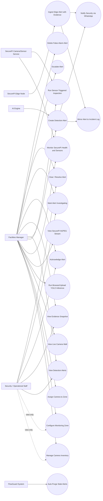

# FlowGuard — Object Detection / SecurePi Use-Case Documentation

Scope: this document describes the **implemented** Object Detection and SecurePi workflow only — camera inventory management, live camera/AI-inference viewing, zone-based detection configuration, sensor-triggered inspection, and the detection-alert lifecycle (creation via AI engine, browser, or SecurePi edge device; review; evidence retrieval; and resolution by Facilities Managers/Staff). It was re-audited against the frontend pages, route guards, backend routes/middleware/services, and the Raspberry Pi scripts on 2026-08-09, branch `feature/object-detection-v2`. No feature or actor is included unless it is traceable to code.

---

## 1. System Scope

The feature spans four cooperating components:

1. **FlowGuard web app (React frontend + Express/Sequelize backend)** — lets Facilities Managers configure cameras and monitoring zones, view live feeds with AI bounding-box overlays, review evidence snapshots, and manage detection alerts through a status lifecycle.
2. **Python AI engine** — a private service reached through Node's authenticated `/api/yolo/people-count` and `/api/yolo/analyze-frame` proxies for browser/uploaded-video inference; it can also create alerts server-to-server via a shared service key.
3. **SecurePi camera/sensor node (`raspberry-pi4/pi_camera_steam.py` + `sensor_bridge.py`)** — a Raspberry Pi Flask service on port 8081 that streams MJPEG video, serves single JPEG frames, and reports PIR/ultrasonic sensor state read from an Arduino over serial.
4. **SecurePi detection runtime** — the on-device detection process that pushes alerts (with optional JPEG evidence) to FlowGuard over HTTP. It is deployed on the device and is **not checked into this repository**; only its server-side contract (`POST /api/edge/detection-alerts`) is verifiable here.

Out of scope: facial recognition, attendance, booking, chat, and every other FlowGuard module not touching Camera/MonitoringZone/DetectionAlert/IncidentLog data or the pages listed above.

## 2. Actor Descriptions

Only actors backed by actual code (role constants, middleware checks, or a distinct calling identity) are included.

| Actor | Backed by | Description |
|---|---|---|
| **Facilities Manager (FM)** | `ROLES.FM` (`client/src/constants/roles.js`, `server/middlewares/auth.js`) | Highest internal access. Only role permitted on `/cameras`, `/security-camera`, and `/object-detection`; can also use `/camera-inventory` and `/detection-settings`. Full CRUD on cameras and zones, plus the **only** role allowed to delete a detection alert. |
| **Security/Operational Staff** | `ROLES.STAFF` | Can open `/camera-inventory` and `/detection-settings` by URL, and can list, create, and update `DetectionAlert` rows via the API (`requireRole('FM','Staff')`). **Read-only on cameras and zones** — every camera/zone write is `requireRole('FM')`, so Staff receives 403. Has no route access to `/cameras`, `/security-camera`, or `/object-detection` (blocked by `ACCESS.FM_ONLY`) and no nav link to any of these pages in the sidebar. |
| **Tenant** | `ROLES.TENANT` | Explicitly excluded from every Camera/Zone/DetectionAlert route and page in this feature (`ACCESS.FM_ONLY` / `ACCESS.FM_STAFF` never include `TENANT`); confirmed blocked (403) from alert status changes in `server/tests/.../detection-alerts.test.js`. |
| **AI Engine (Python YOLO service)** | `verifyServiceOrRole` + `x-service-key` header matched against `AI_SERVICE_KEY` (`server/middlewares/auth.js`) | A trusted private service that can create `DetectionAlert` rows via `POST /api/detection-alerts` without a user JWT. Also exempt from rate limiting. Browser people-count and frame-analysis calls first pass through Node JWT/RBAC, Google ID-token, and service-key handling. |
| **SecurePi Edge Node** | Bearer token compared to `EDGE_INGEST_TOKEN` (`server/routes/edgeDetectionAlerts.js:246-256`) | The on-device detection runtime. Pushes alerts — optionally with a multipart JPEG snapshot — to `POST /api/edge/detection-alerts` using a static shared bearer token distinct from the AI engine's service key. It sends a deterministic `event_id` so Wi-Fi retries are idempotent. |
| **SecurePi Camera/Sensor Service** | `raspberry-pi4/pi_camera_steam.py`, `raspberry-pi4/sensor_bridge.py` | The Pi-side Flask service the browser talks to directly (browser-to-Pi, not through the Node backend): `/video_feed`, `/snapshot`, `/health`, `/sensor_status`. It performs no alert ingestion of its own. |
| **Browser Camera User** | `sourceMode === 'camera'` in `ObjectDetection.jsx` | Not a distinct account/role — an FM user who selects the "Browser Camera" video source (their own device webcam via `getUserMedia`) instead of a hardware/SecurePi feed or an uploaded file. Included because it is a genuine, code-backed mode of interacting with the system, not because it is a separate authentication identity. |

**Actors explicitly not included** because nothing in the code supports them: "System Administrator" (no such role exists — the only roles are `FM`/`Staff`/`Tenant`, confirmed against `client/src/constants/roles.js` and the `User` model's `ENUM('FM','Tenant','Staff')`).

## 3. Use-Case Diagram

## 4. Use-Case Summary Table

| ID | Use Case | Primary Actor(s) | Page / Route |
|---|---|---|---|
| UC1 | Manage Camera Inventory (create, edit, deactivate) | FM (full), Staff (view-only) | `client/src/pages/CameraInventory.jsx` → `/api/cameras` |
| UC2 | Configure Monitoring Zone (thresholds, classes, detection type, severity) | FM only (Staff can read) | `client/src/pages/DetectionSettings.jsx` (`/detection-settings`) → `/api/zones` |
| UC3 | Assign / release a camera on a Detection Setup rule | FM only | `/api/zones` (`camera_id`) or `/api/cameras` (`zone_id`) |
| UC4 | View Live Camera Wall | FM only | `client/src/pages/Cameras.jsx` (`/cameras`) |
| UC5 | Run Browser/Upload YOLO Inference | FM only | `ObjectDetection.jsx`, `CameraFeed.jsx`, `SecurityCamera.jsx` → Node `/api/yolo/*` → private FastAPI |
| UC6 | View SecurePi MJPEG Stream | FM only | `ObjectDetection.jsx` / `SecurityCamera.jsx` (hardware mode) → SecurePi `/video_feed` |
| UC7 | Monitor SecurePi Health and Sensors | FM only | `ObjectDetection.jsx` / `SecurityCamera.jsx` → SecurePi `/health`, `/sensor_status` |
| UC8 | Run Sensor-Triggered Inspection | FM only | `client/src/pages/SecurityCamera.jsx` (`/security-camera`) |
| UC9 | Create Detection Alert | AI Engine, FM via Security Camera page, (FM/Staff manual test alert) | `POST /api/detection-alerts` |
| UC10 | Ingest Edge Alert with Evidence | SecurePi Edge Node | `POST /api/edge/detection-alerts` |
| UC11 | View Detection Alerts | FM, Staff | `ObjectDetection.jsx`, `SecurityCamera.jsx`, `Cameras.jsx` → `GET /api/detection-alerts` |
| UC12 | View Evidence Snapshot | FM, Staff | `GET /api/detection-alerts/:id/snapshot/:filename` |
| UC13 | Acknowledge Alert | FM, Staff | `PUT /api/detection-alerts/:id` |
| UC14 | Mark Alert Investigating | FM, Staff | `PUT /api/detection-alerts/:id` |
| UC15 | Escalate Alert | FM (UI only exposes this on FM-only pages) | `PUT /api/detection-alerts/:id` |
| UC16 | Clear / Resolve Alert | FM, Staff | `PUT /api/detection-alerts/:id` |
| UC17 | Delete False-Alarm Alert | **FM only** | `DELETE /api/detection-alerts/:id` — **API only, no UI yet** |
| UC18 | Auto-Purge Stale Alerts | FlowGuard System (background job) | `server/services/detectionAlertRetention.js` |
| UC19 | Create and link Incident Log | FlowGuard System (atomic side effect of UC9/UC10) | both alert-ingest routes |
| UC20 | Notify Security via WhatsApp | FlowGuard System (post-commit side effect of UC9/UC10) | `server/services/whatsappService.js` |

## 5. Detailed Use-Case Specifications

### UC1 — Manage Camera Inventory
- **Actors:** Facilities Manager (full), Staff (view-only)
- **Trigger:** FM opens `/camera-inventory` to add/edit/deactivate a camera.
- **Preconditions:** Actor is authenticated; `userRole` is `FM` or `Staff` (route allows `ACCESS.FM_STAFF`); for edit/delete, the target camera row exists.
- **Main flow:**
  1. Page loads camera list (`GET /api/cameras`) and zone list (`GET /api/zones`) for the zone-assignment dropdown.
  2. FM clicks "Add Camera" (auto-suggested next `CAM-NN` code) or "Edit" on an existing row.
  3. FM fills `camera_code`, `camera_name`, `location`, optional `zone_id`, `status`, a stream source (preset demo `.mp4` or a custom `http(s)://` URL pointing at a SecurePi MJPEG endpoint), optional `camera_type`/`notes`.
  4. On Save, frontend sends `POST /api/cameras` (create) or `PUT /api/cameras/:id` (edit).
  5. Backend validates required fields, `status` enum, zone existence, zone occupancy, and case-insensitive `camera_code` duplication before persisting.
- **Postconditions:** A `cameras` row is created/updated; `last_active_at` is stamped to the current time.
- **Alternate/Exception flows:**
  - Staff opens the same page: create/edit/delete controls are hidden entirely by the frontend (`canEdit` check at `CameraInventory.jsx:75`), and a "view-only access" banner is shown. This mirrors the server, which returns **403** to Staff on any camera write.
  - Duplicate `camera_code` → `409`; UI shows the error.
  - Chosen zone already has a camera assigned → `409` ("That zone already has a camera assigned…") — see UC3.
  - Custom stream URL not starting with `http://`/`https://` → blocked client-side before submission.
  - Non-existent `zone_id` submitted → `400` from server.
  - Delete: FM clicks Delete, must confirm a second time (`confirmDeleteId` two-click pattern); backend sets `status:'Disabled'` then soft-deletes (`paranoid` — row remains with `deletedAt` set).

### UC2 — Configure Monitoring Zone
- **Actors:** Facilities Manager (full). **Staff can open the page and read zones, but every write returns 403** (`POST`/`PUT`/`DELETE /api/zones` are all `requireRole('FM')`).
- **Trigger:** FM manages zone thresholds via the Detection Setup page (`/detection-settings`).
- **Preconditions:** Authenticated; role FM to save, FM or Staff to view.
- **Main flow:** Create/update a `monitoring_zones` row: `zone_name`, `location`, `time_threshold` (legacy minutes, required), optionally `density_threshold`, `unattended_threshold_seconds`, `alert_cooldown_seconds`, `severity`, `assigned_team`, `detection_enabled`, `detection_type`, `monitored_classes` (comma list or array, serialized to a JSON string), and `camera_id` (UC3).
- **Postconditions:** A `monitoring_zones` row is created/updated. `unattended_threshold_seconds`, when set, takes precedence over `time_threshold` in the AI engine's threshold logic. `detection_type` determines which IncidentLog type alerts in this zone bridge to (UC19).
- **Alternate/Exception flows:** Missing required fields, non-positive numeric thresholds, invalid `severity`, invalid `detection_type` (must be `unattended_object`, `crowd_density`, or `unauthorized_access`), or an empty `monitored_classes` list after cleaning → `400` from `server/routes/zones.js`. Staff attempting to save → `403`.

### UC3 — Assign / release a camera on a Detection Setup rule
- **Actors:** Facilities Manager only
- **Trigger:** FM picks a camera for a Detection Setup rule, or assigns a zone to a camera from Camera Inventory.
- **Business rule:** **A zone holds at most one camera.** Enforced symmetrically in route code — `zones.js` rejects a `camera_id` already held by another rule, and `cameras.js` rejects a `zone_id` that already has a camera. There is no DB constraint behind either check.
- **Main flow (from the zone side):** `POST`/`PUT /api/zones` with `camera_id`. On PUT the field is **tri-state**: omitted leaves the assignment untouched, `null` releases the current camera, and a value swaps in the new camera while releasing the old one — all in one transaction, so a failed assignment preserves both the old mapping and the zone's fields.
- **Main flow (from the camera side):** `POST`/`PUT /api/cameras` with `zone_id`.
- **Postconditions:** `cameras.zone_id` points at the rule; the previous holder is released.
- **Alternate/Exception flows:** Camera/zone not found → `400`. Already assigned elsewhere → `409`. Re-saving the same camera on the same zone is always allowed. Deleting a zone (UC2) releases its camera first, so it becomes immediately available.

### UC4 — View Live Camera Wall
- **Actors:** Facilities Manager only (`ACCESS.FM_ONLY` on `/cameras`)
- **Trigger:** FM opens `/cameras` ("Camera Network").
- **Preconditions:** Authenticated; role FM.
- **Main flow:**
  1. Page loads the camera inventory and renders a `<CameraFeed>` tile per camera.
  2. A side panel polls `GET /api/detection-alerts` every 15 s and lists active alerts with a one-click "Mark cleared" action (`PUT` status `Cleared`) for `Active` alerts.
  3. FM can select a feed for a detail view with quick links to "Manage" (Camera Inventory) and "Detection" (Object Detection page).
- **Postconditions:** No persistent state change from viewing; clearing an alert transitions its `status` to `Cleared`.

### UC5 — Run Browser/Upload YOLO Inference
- **Actors:** Facilities Manager only (`ACCESS.FM_ONLY` on `/object-detection` and `/security-camera`)
- **Trigger:** FM selects the "Browser Camera" or "Upload File" source mode, or an inspection cycle begins (UC8).
- **Preconditions:** Authenticated; role FM; browser grants camera permission for the webcam mode.
- **Main flow:**
  1. Frontend captures a video frame, encodes it as a base64 JPEG data URL, and `POST`s to Node `/api/yolo/analyze-frame` with `{ image, source, camera_id?, zone_id? }` and the user JWT. Cadence differs per surface: **~2.2 s** on the Object Detection page, **1.8 s** on a `CameraFeed.jsx` tile, and **350 ms** on the Security Camera page during an active inspection cycle.
  2. AI engine returns bounding boxes/classes/confidences; frontend draws them, filtering by a confidence threshold per class and a fixed allow-list of relevant classes.
  3. A separate authenticated poll to Node `/api/yolo/people-count` every 5 s feeds the people-count state; Node calls private FastAPI.
- **Postconditions:** No database writes occur from the inference call itself — it is a display-only loop. On the Security Camera page, its *results* may trigger UC9.
- **Exception flow:** After 3 consecutive `people-count` failures, the page shows an "AI engine offline" banner. Node returns `400` for a malformed data URL, `413` over 8 MiB, `429` on the AI-proxy rate limit, `502` upstream error, `503` when the AI service is unreachable.

### UC6 — View SecurePi MJPEG Stream
- **Actors:** Facilities Manager only
- **Trigger:** FM selects "Hardware/SecurePi" as the video source (or a camera whose inventory `stream_url` is an `http(s)://.../video_feed` URL is shown on the Camera Wall).
- **Preconditions:** A reachable Pi camera service exposing `GET /video_feed` (`raspberry-pi4/pi_camera_steam.py`, port 8081). The frontend resolves the URL via `client/src/utils/securepiStream.js` in this order: **per-camera `localStorage` override → the selected camera's `stream_url` → `VITE_SECUREPI_STREAM_URL`**. Every candidate must pass `validateSecurePiStreamUrl()`, which requires an absolute `http(s)` URL and rejects embedded credentials, fragments, and secret-looking query keys.
- **Main flow:** Browser renders a plain `` tag pointed at the MJPEG endpoint — the browser natively decodes the `multipart/x-mixed-replace` stream frame-by-frame. No `analyze-frame` calls are made *for the stream itself*; the Security Camera page instead pulls single frames from `/snapshot` when it needs to analyse one.
- **Postconditions:** None (view-only). Hardware status UI state reflects `loading`/`live`/`error` from the `` `onLoad`/`onError` events plus the health poll (UC7).
- **Exception flow:** On stream error, UI shows a feed-unavailable state and a reconnect button that forces a cache-busted reload. The per-camera `localStorage` override exists precisely so different users on the same hotspot can correct an unreachable URL without changing cloud data.

### UC7 — Monitor SecurePi Health and Sensors
- **Actors:** Facilities Manager only
- **Trigger:** Automatic, while a page is open in hardware mode.
- **Main flow:** `testSecurePiConnection()` polls `GET <stream-origin>/health` every **5 s** (`SECUREPI_POLL_MS`) and, when `/health` carries no embedded `sensor` block, additionally probes `GET /sensor_status`. It optionally probes `/people-count`, treating `404`/`405`/`501` as "not supported" rather than a failure.
- **Response handling:** Unlike a bare liveness check, the body **is** inspected. `normalizeHealth()` requires `status` ∈ `ok|online|healthy|connected|degraded|stale` and type-checks `detection_active`/`streaming`; anything else is `invalid-response`. A frame older than 10 s (`SECUREPI_STALE_FRAME_SECONDS`), or `status: stale|degraded`, or `streaming: false`, downgrades the connection to **stale** rather than connected.
- **Failure classification:** `timeout`, `unreachable`, `permission-required` (browser Local Network Access), `invalid-response`, `invalid-url`, `aborted` — each with its own banner message.
- **Sensor data:** `/sensor_status` reports `pir`/`motion`, `distance_cm`, `baseline_distance_cm`, `object_close`, `trigger`, `inspection_active`, `inspection_remaining_seconds`, `after_hours`, and an inspection/cycle id, read from an Arduino over serial by `raspberry-pi4/sensor_bridge.py` (`EDGE_SERIAL_PORT`, default `/dev/ttyACM0`). Returns **503** when the bridge is disabled.
- **Postconditions:** Drives the live/connecting/offline banner state; no data is persisted.

### UC8 — Run Sensor-Triggered Inspection
- **Actors:** Facilities Manager only (`ACCESS.FM_ONLY` on `/security-camera`)
- **Trigger:** The Pi's sensor bridge reports `inspection_active: true` (PIR motion or a significant ultrasonic distance change from the stable baseline), carrying an `inspection_id`/`cycle_id` and an `after_hours` flag.
- **Preconditions:** Authenticated; role FM; a reachable SecurePi camera/sensor service.
- **Main flow:**
  1. The page detects the active cycle from the sensor poll (UC7) and captures its id.
  2. Frame analysis switches to a **350 ms** cadence (UC5) for the duration of the cycle.
  3. If a **person** is detected, the page resolves identity context (`person_name`, `identity_status`, `person_role`, `track_id`) and POSTs a `RESTRICTED_MOTION` alert (UC9) with `source: 'Browser Webcam'`, the full sensor reading in `sensor_metadata`, and **`event_id` = the inspection cycle id**.
  4. If an **animal** is detected instead, it POSTs a `RESTRICTED_MOTION` alert with the animal class and `severity: 'High'`.
  5. The cycle is marked processed so one cycle can raise at most one alert client-side; the server's idempotency on `edge_event_id` is the second line of defence.
- **Postconditions:** A `detection_alerts` row (plus linked incident and possible WhatsApp) exists for the cycle; the new alert is prepended to the page's list and selected.
- **Alternate/Exception flows:** The page surfaces distinct messages for `401`/`403` ("Authentication error"), `400` ("Invalid payload parameters"), `5xx` ("Server error"), and network failure. A repeated cycle id returns **200** with the existing alert rather than creating a duplicate.

### UC9 — Create Detection Alert
- **Actors:** AI Engine (via service key), FM via the Security Camera page (via JWT), or an FM/Staff user creating a manual test alert.
- **Trigger:** The AI engine or an inspection cycle determines a condition warrants an alert.
- **Preconditions:** Caller supplies header `x-service-key` matching `AI_SERVICE_KEY`, **or** a valid FM/Staff JWT.
- **Main flow:**
  1. Caller submits `zone_name`, `camera_location` (both required), and optional `status`, `object_class`, `duration_seconds`, `person_name`, `identity_status`, `person_role`, `alert_type`, `severity`, `source`, `confidence`, `snapshot_url`/`snapshot_path`, `device_id`, `track_id`, `sensor_metadata`, `event_id`/`cycle_id`, `timestamp`/`occurred_at`.
  2. Server validates `status` and `severity` against their fixed lists.
  3. **Idempotency check:** if `event_id`/`cycle_id` (or `sensor_metadata.cycle_id`) matches an existing `edge_event_id`, the server returns **200 with the existing alert** and creates nothing.
  4. Server best-effort resolves `zone_id` (exact match on `MonitoringZone.zone_name`) and `camera_id` (exact match on `Camera.camera_name` or `Camera.location`) — leaves them `null` if no match — and reads the matched zone's `detection_type`.
  5. Defaults are applied: `object_class` → `'package-like object'`, `alert_type` → `'Unattended Object'`, `status` → `'Active'`, `source` → whitelisted (see business rules), and `severity` → **type-aware** via `defaultSeverityForType()` rather than a flat `High`.
  6. `DetectionAlert` row and its mapped `IncidentLog` are created in one transaction and linked (UC19).
  7. Post-commit, a WhatsApp security notification may be attempted (UC20).
- **Postconditions:** Linked `detection_alerts` and `incident_logs` rows; `201` returns the created alert (including its `whatsapp_status`). If either create/link step fails, the transaction rolls back.
- **Alternate/Exception flows:**
  - Missing `zone_name`/`camera_location` → `400`.
  - Invalid `status`/`severity` → `400`.
  - No/invalid service key and no valid JWT → `401`; valid JWT but wrong role → `403`.
  - Rate limit exceeded → `429` (service-key callers are exempt).
  - Unknown extra payload fields are silently dropped (whitelist-style field extraction), not persisted or rejected.
  - A non-whitelisted `source` is silently downgraded to `'Object Detection'` rather than rejected.

### UC10 — Ingest Edge Alert with Evidence
- **Actor:** SecurePi Edge Node
- **Trigger:** The on-device detection runtime judges an object unattended (or detects a pest, restricted-zone motion, forgotten belonging, or item movement).
- **Preconditions:** Caller supplies `Authorization: Bearer <token>` matching `EDGE_INGEST_TOKEN`. This token is accepted **only** on the edge route, not on `/api/detection-alerts` (confirmed by test: reusing an edge token there yields 403, not 201).
- **Main flow:**
  1. Device POSTs JSON, **or** `multipart/form-data` with the alert fields plus a `snapshot` JPEG part.
  2. The snapshot is validated before the bytes are accepted: JPEG MIME type, `.jpg`/`.jpeg` filename with no path syntax (checked raw and through up to three URL-decodings), ≤ `DETECTION_SNAPSHOT_MAX_BYTES` (default 5 MiB), and real `FF D8 … FF D9` magic bytes.
  3. `source` in the body is **ignored**; the row is always written as `'SecurePi Edge Node'`.
  4. `event_id` is validated against `/^[A-Za-z0-9._:-]{1,255}$/` and becomes the unique `edge_event_id`.
  5. Alert + incident are created atomically (UC19); `occurred_at` falls back to server receipt time if the device sent none.
  6. **After** the transaction commits, the snapshot bytes are stored under a server-generated UUID filename and `snapshot_url` is set to `/api/detection-alerts/<id>/snapshot/<uuid>.jpg`.
  7. Post-commit, WhatsApp may be attempted (UC20).
- **Postconditions:** A `detection_alerts` row with `source: 'SecurePi Edge Node'`, a linked incident, and (when evidence was attached) a retrievable snapshot. Response is **201**.
- **Alternate/Exception flows:**
  - **Duplicate `event_id` → 200, not 201**, returning the existing alert. If the retry carries new JPEG evidence, `snapshot_url` and `occurred_at` are refreshed and the superseded object deleted — `createdAt` is untouched. A duplicate whose stored `whatsapp_status` is `Failed` (and which still passes the severity gate) is retried and returned with `resent: true`; every other status returns as-is with no resend.
  - Two simultaneous requests with the same `event_id`: the loser hits the unique index, the handler recovers the winner's row rather than returning 500.
  - Snapshot storage failure is logged but does **not** fail the request — the alert already committed, so returning 500 would cause a pointless retry and leave WhatsApp stuck in `Pending`.
  - Missing `zone_name`/`camera_location`, invalid `status`/`severity`, malformed `event_id`, or any snapshot rejection → `400`.
  - Missing/wrong bearer token → `401`; `EDGE_INGEST_TOKEN` not configured server-side → `503`.

### UC11 — View Detection Alerts
- **Actors:** FM, Staff
- **Trigger:** Object Detection, Security Camera, or Camera Wall page loads/polls.
- **Preconditions:** Authenticated; role FM or Staff (`requireRole('FM','Staff')`).
- **Main flow:** `GET /api/detection-alerts` returns up to 50 alerts, optionally filtered by a `status` query param, ordered by `COALESCE(occurred_at, createdAt) DESC` — i.e. by **when the event happened**, falling back to row-creation time only when no event time was supplied. Poll cadence is 3 s on Object Detection and 15 s on Security Camera and the Camera Wall. `GET /api/detection-alerts/:id` reads a single alert.
- **Postconditions:** None (read-only).

### UC12 — View Evidence Snapshot
- **Actors:** FM, Staff
- **Trigger:** FM selects an alert whose `snapshot_url` is a protected application path.
- **Preconditions:** Authenticated; role FM or Staff; the alert has a stored snapshot.
- **Main flow:** The page recognises the protected form (`/api/detection-alerts/<id>/snapshot/<file>`), fetches it with the JWT and `responseType: 'blob'`, and renders an object URL inline with a "View edge snapshot" link. The server re-derives the filename **from the alert's own stored `snapshot_url`**, requires the requested filename to match it exactly, UUID-validates it, and only then reads from GCS or local disk.
- **Postconditions:** None (read-only). The image is never publicly reachable — there is no signed or public URL.
- **Alternate/Exception flows:**
  - Any failure — bad id, bad filename format, alert missing, no stored snapshot, mismatch, object missing from storage — returns the same **404 with an empty body**, so the endpoint reveals nothing about what exists.
  - A `snapshot_url` that is *not* in the protected form is treated as an on-device edge path and deliberately **never** rendered as a clickable link; the UI shows "Snapshot captured on the edge device; remote upload unavailable."
  - If the fetch fails, the UI shows "Snapshot upload found, but the image could not be loaded."

### UC13 — Acknowledge Alert
- **Actors:** FM, Staff
- **Preconditions:** Alert exists and is currently `Active` (UI only enables the "Acknowledge" button in that state, though the API itself does not enforce a specific from-state).
- **Main flow:** `PUT /api/detection-alerts/:id` with `{status:'Acknowledged'}`.
- **Postconditions:** Alert `status` becomes `Acknowledged`; the linked incident's `resolutionStatus` stays `Active` (UC19).

### UC14 — Mark Alert Investigating
- **Actors:** FM, Staff
- **Main flow:** `PUT /api/detection-alerts/:id` with `{status:'Investigating'}`, triggered either from the lifecycle button or by clicking an alert row in the "Latest Detection Alerts" list.
- **Postconditions:** Alert `status` becomes `Investigating`; linked incident `resolutionStatus` → `Investigating`.

### UC15 — Escalate Alert
- **Actors:** FM (this action button is only present on FM-only pages)
- **Main flow:** `PUT /api/detection-alerts/:id` with `{status:'Escalated'}`.
- **Postconditions:** Alert `status` becomes `Escalated`; linked incident `resolutionStatus` → `Escalated to Security`.
- **Note:** The API allows any FM/Staff caller to set any valid status via this same endpoint; the restriction to FM reflects which page exposes the button, not a distinct server-side rule.

### UC16 — Clear / Resolve Alert
- **Actors:** FM, Staff
- **Main flow:** `PUT /api/detection-alerts/:id` with `{status:'Cleared'}` — available as "Mark Resolved" on Object Detection (always enabled), "Mark cleared" on the Camera Wall (only for `Active` alerts), and as a bulk action that issues one PUT per open alert.
- **Postconditions:** Alert `status` becomes `Cleared`; linked incident `resolutionStatus` → `Cleared`.

> **Applies to UC13–UC16:** the PUT endpoint accepts **only** `status`, `severity`, and `person_name`. Any other key in the body is rejected with `400 "Unsupported field(s): …"` — it is a strict allow-list, not a free-form patch. All three fields, when supplied, are mirrored onto the linked incident inside the same transaction.

### UC17 — Delete False-Alarm Alert
- **Actors:** **Facilities Manager only** — the one operation in this feature where Staff is denied but FM is allowed.
- **Trigger:** FM determines an alert was a false alarm.
- **Preconditions:** Authenticated; role FM; alert exists.
- **Main flow:** `DELETE /api/detection-alerts/:id`. In one transaction the server soft-deletes the linked `IncidentLog` (so it stops showing as an active incident, matching the incident dashboard's own delete behaviour) and then soft-deletes the alert.
- **Postconditions:** Both rows remain in the database with `deletedAt` set — the audit trail survives. The stored snapshot object is **not** removed here; it is cleaned up by UC18.
- **Alternate/Exception flows:** Staff or Tenant → `403`. Non-numeric or unknown id → `404` with an empty body.
- **Implementation status:** the endpoint is fully implemented and role-gated, but **no page in `client/src` calls it** — there is no `axios.delete` against this URL anywhere in the frontend. This use case is currently reachable only through the API directly; the UI for it has not been built.

### UC18 — Auto-Purge Stale Alerts
- **Actor:** FlowGuard System (background job, no human actor)
- **Implementation:** `createDetectionAlertRetentionTask()` in `server/services/detectionAlertRetention.js`, attached to the alerts router as `retentionTask` and started by `server/index.js` **only after database initialization succeeds** — constructing the route must never start process handles. It is stopped on graceful shutdown.
- **Trigger:** Runs 20 s after the task starts, then every 24 hours.
- **Main flow:** Finds alerts with `createdAt` older than 30 days (including soft-deleted ones, `paranoid: false`), deletes each one's stored snapshot object, then `DetectionAlert.destroy({ ..., force: true })` — a **hard** delete that bypasses the paranoid soft-delete.
- **Postconditions:** Matching rows and their evidence images are permanently removed; the count is logged.
- **Exception flow:** Any error is logged and swallowed — retention is maintenance work and must never terminate request handling or affect database readiness.

### UC19 — Create and link Incident Log
- **Actor:** FlowGuard System (side effect of either ingest path).
- **Trigger:** During `POST /api/detection-alerts` or `POST /api/edge/detection-alerts`.
- **Main flow:** Inside one managed transaction the server creates the `DetectionAlert`, resolves the incident **type** via `resolveIncidentType()`, creates the `IncidentLog`, and updates `DetectionAlert.incident_log_id`.
- **Type resolution:** an explicit zone `detection_type` wins (`unattended_object → UNATTENDED_OBJECT`, `crowd_density → OVERCROWDING`, `unauthorized_access → UNAUTHORIZED_ACCESS`). Otherwise the alert's `alert_type` + `object_class` text is matched most-specific-first: unauthorized → pest (whole-word `rat`/`mouse`/`mice`/`rodent`/`pest`) → restricted-zone/after-hours/night motion → forgotten belonging → item movement → person/crowd → `UNATTENDED_OBJECT` as the default. The ordering is deliberate so a pest sighting or after-hours motion is never mislabelled `OVERCROWDING`.
- **Postconditions:** `detection_alerts.incident_log_id` links to `incident_logs.id`. Status, severity, person, and soft-deletion stay synchronised by the respective update/delete routes.
- **Note:** `IncidentLog.status` stores the incident **type**, not a workflow state — that lives in `resolutionStatus`.
- **Exception flow:** Any create/link failure returns 500 and rolls back the transaction; old rows predating the nullable link remain supported without synchronisation.

### UC20 — Notify Security via WhatsApp
- **Actor:** FlowGuard System (post-commit side effect of UC9/UC10).
- **Trigger:** A detection alert has just been committed.
- **Gate (all must pass):** `WHATSAPP_DETECTION_ALERTS_ENABLED=true`, at least one recipient in `WHATSAPP_SECURITY_RECIPIENTS`, and the alert's severity meets `WHATSAPP_DETECTION_MIN_SEVERITY`. `WHATSAPP_ENABLED` separately governs real vs. **simulated** delivery — `false` is the safe demo default.
- **Main flow:** The edge route stamps `whatsapp_status: 'Pending'` **inside** the alert transaction, so a concurrent duplicate request sees it and never starts a second send. The message is then built and dispatched post-commit, and the outcome written to `whatsapp_status` / `whatsapp_sent_at` / `whatsapp_error`.
- **Statuses:** `Not Requested` (switch off) · `Pending` · `Sent` · `Simulated` · `Skipped` (no recipients / below severity) · `Failed`.
- **Postconditions:** Notification state is recorded on the alert; the edge response carries a public `whatsapp` object.
- **Exception flow:** A notification failure **never** fails the request or rolls back the alert. The public response returns a generic `"Notification delivery failed."` rather than provider detail, and never includes phone numbers or tokens. Even a database error while stamping the status is swallowed rather than allowed to break the response.

## 6. Alternate and Exception Flows (Cross-Cutting)

- **No/expired JWT** on any protected route → `401 "Access Denied. No security token provided."` (no token) or `403 "Invalid or expired security token."` (bad/expired token), from `verifyToken`.
- **Account deleted after token issuance** → `401 "Account no longer exists. Session terminated."` (server re-checks the DB on every request, not just the JWT payload).
- **Account suspended (`isActive:false`)** → `403 "Account suspended. Session terminated."`.
- **Session revoked** (password reset / suspension bumped `tokenVersion`) → `401 "Session revoked. Please log in again."`, even if the JWT itself hasn't expired.
- **Authenticated but wrong role** → `403 "Insufficient permissions for this resource."` from `requireRole`.
- **Rate limit exceeded** → `429 { "message": "Too many requests. Please try again later." }`. Every router in this feature is limited before authentication: 300/min/user for zones, cameras, and alerts; 1200/min for `/api/yolo/*` and `/api/edge/*`. Trusted AI-engine callers (valid `x-service-key`) are exempt. Counters are in-memory and therefore **per Node process**, not global.
- **Frontend route-guard mismatch** (`ProtectedRoute.jsx`): no `accessToken` in `localStorage` → redirect to `/error/401`; role not in the page's `allowedRoles` → redirect to `/error/403`. This is a client-side convenience check only (reads `localStorage`, no signature verification) — the server-side checks above are the actual authorization boundary.
- **Sidebar visibility vs. route permission mismatch:** Staff is permitted by the route guard to open `/camera-inventory` and `/detection-settings` directly by URL, but the sidebar renders those links only when `isFM` — so Staff has no in-app navigation entry point to the pages it is technically allowed to view.
- **SecurePi stream/health unreachable** → the pages show a classified error state (timeout / unreachable / permission-required / invalid response) rather than failing the page.
- **404 bodies are inconsistent.** `GET/PUT/DELETE /api/zones/:id`, `GET/PUT/DELETE /api/detection-alerts/:id`, and the snapshot route all use `res.sendStatus(404)` with **no JSON body**, while the camera routes return `{ "error": "Camera not found." }`. Frontend error handling must not assume a single envelope.

## 7. Business Rules

1. A camera's `status` must be one of `Online`, `Offline`, `Maintenance`, `Disabled` — enforced as a true Postgres ENUM plus a route-level check.
2. A `camera_code` must be unique, checked case-insensitively — enforced only in application code (`server/routes/cameras.js`), not by a database constraint.
3. **A monitoring zone holds at most one camera.** Enforced symmetrically by `zones.js` and `cameras.js` with a `409`; no DB constraint backs it. Deleting a zone releases its camera first.
4. A `DetectionAlert.status` must be one of `Active`, `Acknowledged`, `Investigating`, `Dispatched`, `Escalated`, `Cleared` — enforced only in route code (the column itself is a plain string, unlike `Camera.status`).
5. `severity` (on both `DetectionAlert` and `MonitoringZone`) must be one of `Low`, `Medium`, `High`, `Critical` — a true ENUM at the DB level.
6. **Default alert severity is type-aware, not a flat value.** When the caller omits `severity`: pest → `High`; restricted motion → `Critical` if the person is suspicious/suspended/unknown, else `High`; forgotten belonging → `High` past 5 minutes, else `Medium`; item picked up/set down/moved → `Medium`; unattended object and everything else → duration-based (`<120 s` Low, `<300 s` Medium, `<600 s` High, `≥600 s` Critical).
7. **An alert's `source` cannot be forged.** The edge route ignores any client-supplied `source` and always writes `'SecurePi Edge Node'`. The standard route accepts only `Browser Webcam`, `Uploaded Video`, or `Object Detection` and silently substitutes the default for anything else — so no caller on that route can make an alert masquerade as edge-ingested.
8. **An edge detection event is idempotent.** `edge_event_id` is unique; a repeated `event_id` returns the existing alert with `200` and creates no second alert, incident, or WhatsApp message. A concurrent race is resolved through the unique index rather than a 500.
9. An `EDGE_INGEST_TOKEN` presented at `/api/edge/detection-alerts` cannot be reused to authenticate against `/api/detection-alerts` — the two ingestion paths use distinct secrets and distinct middleware.
10. Detection alerts older than 30 days are automatically and permanently purged along with their evidence images, independent of their resolution status.
11. `zone_id`/`camera_id` on a `DetectionAlert` are never supplied by the caller — they are always resolved server-side by exact string match against existing zone/camera names, and remain `null` if no match is found; alert creation never fails because of an unresolved link.
12. `monitored_classes` on a `MonitoringZone` must contain at least one non-empty entry if the field is supplied at all.
13. `unattended_threshold_seconds`, when set on a zone, takes precedence over the legacy `time_threshold` (minutes) for the AI engine's unattended-object timing logic.
14. `detection_type` on a zone must be one of `unattended_object`, `crowd_density`, `unauthorized_access`, and determines the incident type its alerts bridge to; edge categories (pest, restricted motion, forgotten belonging, item movement) are **inferred from alert text**, never chosen per zone.
15. **A detection snapshot is only ever readable through an authenticated request.** The served filename is re-derived from the alert row's own `snapshot_url`, so a client-supplied filename can authorise that one stored resource but never select a different file. No public or signed object URL is generated.
16. Only a Facilities Manager may delete a detection alert; deletion is a soft-delete on both the alert and its linked incident, preserving the audit trail.

## 8. Preconditions and Postconditions (Summary by Data Entity)

| Entity | Created by | Precondition to create | Postcondition |
|---|---|---|---|
| `cameras` row | FM via Camera Inventory | Unique `camera_code`; if `zone_id` given, zone must exist and hold no other camera | Row persisted; `last_active_at` stamped |
| `monitoring_zones` row | FM via Detection Setup | `zone_name`, `location`, positive `time_threshold` required; valid `detection_type` if given; `camera_id` free if given | Row persisted; camera assigned in the same transaction |
| `detection_alerts` row | AI Engine, SecurePi Edge Node, Security Camera page, or FM/Staff manual call | Valid service key / edge token / JWT+role; `zone_name` and `camera_location` present; valid `status`/`severity` if given; `event_id` not already used | Row persisted with `status` defaulting to `Active` and a type-aware severity; IDs best-effort resolved; `incident_log_id` links the atomically created incident; `whatsapp_status` stamped |
| `incident_logs` row (Object-Detection-originated) | FlowGuard System, as a side effect of either alert path | Same transaction as DetectionAlert | Row persisted with the resolved incident type in `status` and linked from `DetectionAlert.incident_log_id` |
| Snapshot object (GCS or local disk) | SecurePi Edge Node via multipart upload | Valid edge token; JPEG passing MIME, filename, size, and magic-byte checks | Bytes stored under a server-generated UUID; `snapshot_url` set to the authenticated app path |

## 9. Traceability to Pages, Routes, and Database Entities

| Page / Component | Route(s) called | DB entities touched |
|---|---|---|
| `client/src/pages/CameraInventory.jsx` | `GET/POST/PUT/DELETE /api/cameras`, `GET /api/zones` | `cameras`, `monitoring_zones` (read + assignment) |
| `client/src/pages/DetectionSettings.jsx` | `GET/POST/PUT/DELETE /api/zones`, `GET /api/cameras` | `monitoring_zones`, `cameras` (assignment) |
| `client/src/pages/Cameras.jsx` | `GET /api/cameras`, `GET/PUT /api/detection-alerts` | `cameras`, `detection_alerts` |
| `client/src/pages/ObjectDetection.jsx` | `GET /api/zones`, `GET /api/cameras`, `GET/PUT /api/detection-alerts`, `GET /api/detection-alerts/:id/snapshot/:filename`, Node `/api/yolo/people-count` + `/api/yolo/analyze-frame`, SecurePi `/video_feed` + `/health` | `monitoring_zones`, `cameras`, `detection_alerts`, linked `incident_logs` |
| `client/src/pages/SecurityCamera.jsx` | `GET /api/zones`, `GET /api/cameras`, `GET/POST/PUT /api/detection-alerts`, Node `/api/yolo/*`, SecurePi `/video_feed` + `/health` + `/sensor_status` + `/snapshot` | `monitoring_zones`, `cameras`, `detection_alerts`, linked `incident_logs` |
| `client/src/pages/CameraFeed.jsx` (embedded in Cameras.jsx) | SecurePi `/video_feed` (hardware mode) or Node `/api/yolo/analyze-frame` (local video mode) | none directly |
| `client/src/utils/securepiStream.js` | SecurePi `/health`, `/sensor_status`, `/people-count`, `/snapshot` | none |
| `server/routes/cameras.js` | — | `cameras`, `monitoring_zones` (existence + occupancy check) |
| `server/routes/zones.js` | — | `monitoring_zones`, `cameras` (assignment/release) |
| `server/routes/detectionAlerts.js` | — | `detection_alerts`, `monitoring_zones`/`cameras` lookup, `incident_logs` atomic create/link and bidirectional sync |
| `server/routes/edgeDetectionAlerts.js` | — | `detection_alerts`, `monitoring_zones`/`cameras` lookup, `incident_logs`, snapshot storage |
| `server/services/detectionAlertRetention.js` | — | `detection_alerts` (hard delete), snapshot storage (delete) |
| `server/services/whatsappService.js` | Meta WhatsApp Cloud API (external) | `detection_alerts` (`whatsapp_*` columns) |
| `server/utils/detectionSnapshotStorage.js` | Google Cloud Storage or local disk | none (file/object store only) |
| `server/utils/detectionAlertBridge.js`, `server/config/detectionTypes.js` | — | `incident_logs` (type resolution) |
| `raspberry-pi4/pi_camera_steam.py` | Serves `/video_feed`, `/snapshot`, `/health`, `/sensor_status` for direct browser-to-Pi access (port 8081) | none directly |
| `raspberry-pi4/sensor_bridge.py` | Reads PIR/ultrasonic readings from an Arduino over serial | none directly |
| *SecurePi detection runtime (not in this repo)* | Calls FlowGuard `POST /api/edge/detection-alerts` | `detection_alerts` (via that route) |

## 10. Current Limitations

- **No admin/system-administrator role exists** — all access control collapses to the three roles `FM`/`Staff`/`Tenant`; there is no dedicated super-user or audit role for this feature.
- **Client-side route guarding (`ProtectedRoute.jsx`) trusts `localStorage` values with no signature check** — it is a UX convenience only; the real authorization boundary is entirely server-side (`verifyToken`/`requireRole`), which is correctly enforced independently.
- **Sidebar navigation and route permissions are inconsistent for Staff** — Staff can reach `/camera-inventory` and `/detection-settings` by direct URL but has no menu entry to them, and can only *read* once there, which may confuse users about what they're allowed to do.
- **The SecurePi detection runtime is not in this repository.** Only its server-side contract can be verified here, so the on-device detection, tracking, owner-return, and alert-cooldown logic is undocumented and untestable from this codebase. A deployment needs both that runtime and `raspberry-pi4/pi_camera_steam.py` — neither replaces the other.
- **Camera stream, health, and sensor endpoints are unauthenticated** — the SecurePi `/video_feed`, `/health`, `/sensor_status`, and `/snapshot` endpoints are fetched directly by the browser with no token, relying solely on network placement/firewalling. This now sits awkwardly beside detection **snapshots**, which are fully authenticated: the same camera's live frames are open while its recorded evidence is locked down.
- **Edge trust is device-wide, not per-device.** A single shared `EDGE_INGEST_TOKEN` grants alert creation *and* snapshot upload from any source IP, with no binding to `device_id`. Upload abuse is bounded only by the size/format checks and the rate limiter.
- **Rate limiting is per Node process** (in-memory store), so on an autoscaled deployment the effective limit is per-instance rather than global.
- **`DetectionAlert.incident_log_id` is nullable and not unique.** Current ingest creates one linked alert/incident pair atomically, but older alerts can remain unlinked and the database does not enforce one-to-one cardinality.
- **Two independent implementations of alert validation, default severity, and link resolution** exist (`server/routes/detectionAlerts.js` and `server/routes/edgeDetectionAlerts.js`). They agree today, but duplicated logic can still drift.
- **Zone/camera link resolution for alerts depends on exact, case-sensitive string matches** against non-unique `zone_name`/`camera_name`/`location` fields — duplicate names can cause an alert to link to the wrong zone/camera, or none at all.
- **The one-camera-per-zone rule has no database backing** — it holds only as long as every write goes through the route handlers.
- **UC17 (false-alarm deletion) has no user interface.** The endpoint is implemented, tested, and the only FM-exclusive operation in the feature, but nothing in `client/src` calls it — an FM cannot currently remove a false alarm without hitting the API directly.
- **The 30-day alert auto-purge (UC18) is unconditional** — it deletes alerts and their evidence regardless of whether they were ever acknowledged/resolved, with no configurable retention policy in the code.
- **Snapshot storage has no referential integrity with the database** — nothing reconciles orphaned objects if an alert row is removed outside the retention job or a storage delete silently fails.
