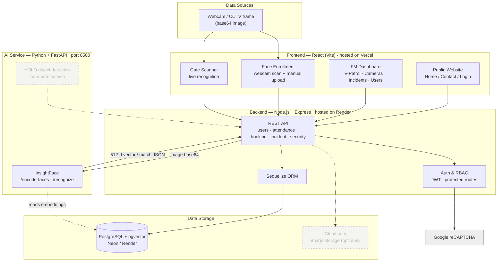

# FlowGuard – System Architecture Diagram

**Dashed = future / simulated for this PoC** (YOLO object-detection is a teammate's separate
service; Cloudinary is only needed if photo files are persisted).