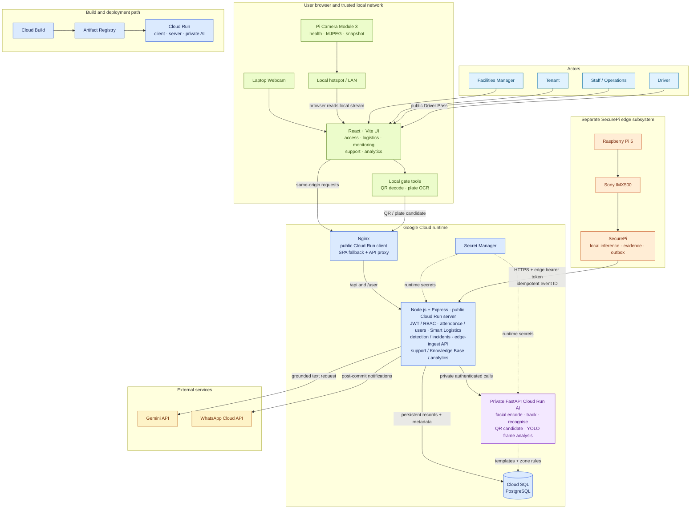

# FlowGuard architecture diagram

```mermaid
flowchart TB
  subgraph ACTORS["Actors"]
    direction LR
    FM["Facilities Manager"]
    TEN["Tenant"]
    STF["Staff / Operations"]
    DRV["Driver"]
  end

  subgraph LOCAL["User browser and trusted local network"]
    direction LR
    WEB["Laptop Webcam"] --> UI["React + Vite UI<br/>access · logistics · monitoring<br/>support · analytics"]
    PI3["Pi Camera Module 3<br/>health · MJPEG · snapshot"] --> LAN["Local hotspot / LAN"] -->|"browser reads local stream"| UI
    UI --> GATE["Local gate tools<br/>QR decode · plate OCR"]
  end

  subgraph CLOUD["Google Cloud runtime"]
    direction LR
    NGINX["Nginx<br/>public Cloud Run client<br/>SPA fallback + API proxy"]
    NODE["Node.js + Express · public Cloud Run server<br/>JWT / RBAC · attendance / users · Smart Logistics<br/>detection / incidents · edge-ingest API<br/>support / Knowledge Base / analytics"]
    AI["Private FastAPI Cloud Run AI<br/>facial encode · track · recognise<br/>QR candidate · YOLO frame analysis"]
    SQL[("Cloud SQL<br/>PostgreSQL")]
    SM["Secret Manager"]
    NGINX -->|"/api and /user"| NODE
    NODE -->|"private authenticated calls"| AI
    NODE -->|"persistent records + metadata"| SQL
    AI -. "templates + zone rules" .-> SQL
    SM -. "runtime secrets" .-> NODE
    SM -. "runtime secrets" .-> AI
  end

  subgraph EDGE["Separate SecurePi edge subsystem"]
    direction LR
    PI5["Raspberry Pi 5"] --> IMX["Sony IMX500"] --> SPI["SecurePi<br/>local inference · evidence · outbox"]
  end

  subgraph EXTERNAL["External services"]
    direction LR
    GEM["Gemini API"]
    WA["WhatsApp Cloud API"]
  end

  subgraph DELIVERY["Build and deployment path"]
    direction LR
    BUILD["Cloud Build"] --> REG["Artifact Registry"] --> RUN["Cloud Run<br/>client · server · private AI"]
  end

  FM --> UI
  TEN --> UI
  STF --> UI
  DRV -->|"public Driver Pass"| UI
  UI -->|"same-origin requests"| NGINX
  GATE -->|"QR / plate candidate"| NGINX
  SPI -->|"HTTPS + edge bearer token<br/>idempotent event ID"| NODE
  NODE -->|"grounded text request"| GEM
  NODE -->|"post-commit notifications"| WA

  classDef actor fill:#e0f2fe,stroke:#0369a1,color:#0c4a6e;
  classDef local fill:#ecfccb,stroke:#4d7c0f,color:#365314;
  classDef cloud fill:#dbeafe,stroke:#1d4ed8,color:#172554;
  classDef ai fill:#f3e8ff,stroke:#7e22ce,color:#581c87;
  classDef edge fill:#ffedd5,stroke:#c2410c,color:#7c2d12;
  classDef external fill:#fef3c7,stroke:#b45309,color:#78350f;
  class FM,TEN,STF,DRV actor;
  class WEB,PI3,LAN,UI,GATE local;
  class NGINX,NODE,SQL,SM,BUILD,REG,RUN cloud;
  class AI ai;
  class PI5,IMX,SPI edge;
  class GEM,WA external;
```

Key boundaries:

- The deployed browser uses the public Nginx client as a same-origin proxy to Node; it never calls private FastAPI directly.
- The browser reaches the Camera Module 3 over the trusted local network. Cloud Run does not connect to the Pi private IP.
- SecurePi is a separate Pi 5/IMX500 process that pushes authenticated edge events to Node; this is distinct from the browser-to-Pi stream. Its runtime lives in the canonical external repository [charlisaa/updated_securePi_FlowGuard](https://github.com/charlisaa/updated_securePi_FlowGuard) and is not deployed from this repository.
- Node owns access, logistics, alert, incident, support, and audit decisions. FastAPI returns inference candidates/telemetry.
- PostgreSQL stores records and metadata, not continuous video. FlowGuard alert snapshots are temporary unless an external evidence lifecycle is provided.
- Gemini generates helpdesk text only; deterministic server code owns escalation and writes. WhatsApp failure cannot roll back a committed record.

The matching PNG is generated from this Mermaid source at `design/png/architecture-diagram.png`.
