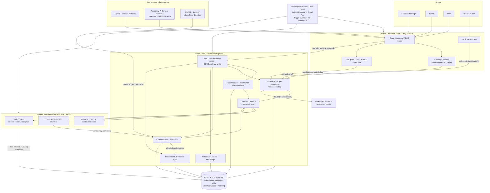

# FlowGuard architecture diagram

```mermaid
flowchart TB
  subgraph Actors["Actors"]
    FM["Facilities Manager"]
    TEN["Tenant"]
    STF["Staff"]
    DRV["Driver / public"]
  end

  subgraph Sources["Camera and edge sources"]
    WEB["Laptop / browser webcam"]
    PI["Raspberry Pi Camera Module 3<br/>snapshot + MJPEG stream"]
    IMX["IMX500 / SecurePi<br/>edge object detection"]
  end

  subgraph Client["Public Cloud Run: React client + Nginx"]
    SPA["React pages and RBAC routes"]
    LOCALQR["Local QR decode<br/>BarcodeDetector / ZXing"]
    OCR["PoC plate OCR + manual correction"]
    PASS["Public Driver Pass"]
  end

  subgraph Server["Public Cloud Run: Node / Express"]
    AUTH["JWT, DB-authoritative RBAC,<br/>CORS and rate limits"]
    ACCESS["Facial access + attendance + security audit"]
    LOGI["Booking + FM gate verification<br/>GateAccessLog"]
    OBJ["Camera / zone / alert APIs"]
    HELP["Helpdesk + tickets + knowledge"]
    INC["Incident CRUD + linked sync"]
    AICRED["Google ID token +<br/>X-AI-Service-Key"]
  end

  subgraph AI["Private authenticated Cloud Run: FastAPI"]
    FACE["InsightFace<br/>encode / track / recognize"]
    QR["OpenCV cloud QR candidate decode"]
    YOLO["YOLO people / object analysis"]
  end

  DB[("Cloud SQL PostgreSQL<br/>authoritative application data<br/>User.faceVector = FLOAT[]")]
  WA["WhatsApp Cloud API<br/>real or mock-safe"]
  BUILD["Developer Connect / Cloud Build<br/>Artifact Registry -> Cloud Run<br/>trigger evidence not checked in"]

  FM --> SPA
  TEN --> SPA
  STF --> SPA
  DRV --> PASS
  WEB --> SPA
  PI --> SPA
  SPA --> LOCALQR
  SPA --> OCR
  SPA -->|"normally /api and /user only"| AUTH
  PASS -->|"safe public booking DTO"| LOGI
  LOCALQR -->|"candidate ref"| LOGI
  OCR -->|"candidate/corrected plate"| LOGI

  AUTH --> ACCESS
  AUTH --> LOGI
  AUTH --> OBJ
  AUTH --> HELP
  AUTH --> INC
  ACCESS --> AICRED
  LOGI -->|"cloud QR fallback only"| AICRED
  OBJ --> AICRED
  AICRED --> FACE
  AICRED --> QR
  AICRED --> YOLO

  IMX -->|"Bearer edge-ingest token"| OBJ
  YOLO -->|"service-key alert event"| OBJ
  OBJ -->|"atomic linked creation"| INC

  ACCESS --> DB
  LOGI --> DB
  OBJ --> DB
  HELP --> DB
  INC --> DB
  FACE -->|"load enrolled FLOAT[] templates"| DB
  LOGI --> WA
  BUILD --> Client
  BUILD --> Server
  BUILD --> AI
```

Key boundaries:

- The browser normally calls Node, not private FastAPI.
- Node supplies the private AI credential. Local QR decoding stays in the browser; cloud QR decoding is Browser -> Node -> FastAPI.
- Facial inference remains FastAPI. Raspberry Pi Camera Module 3 supplies snapshots/stream; SecurePi/IMX500 can send object alerts.
- PostgreSQL is authoritative for identity, booking state, audit records, alerts, and incidents.
- WhatsApp failure never rolls back a completed booking/gate transaction. The physical barrier shown by the UI is simulated.

The matching PNG at `design/png/architecture-diagram.png` was regenerated from this Mermaid source with a transient Mermaid CLI and visually checked on 28 July 2026.
