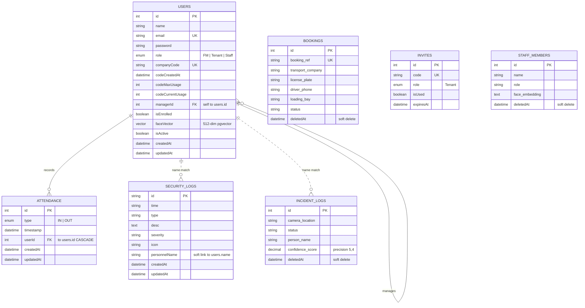

# FlowGuard – Entity Relationship Diagram

**Solid line** = enforced foreign key. **Dotted line** = soft link by name (no DB-level FK).
Tables shown are those present in the access-management codebase; teammates' tables
(Support_Tickets, Chat_Transcripts, Monitoring_Zones, etc.) should be added to complete
the full-system ER.