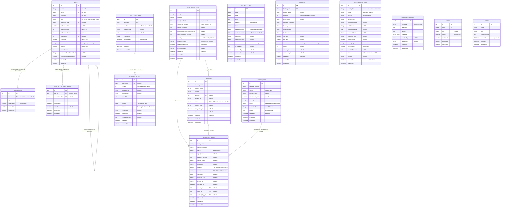

# FlowGuard entity-relationship diagram

```mermaid
erDiagram
  USER o|--o{ ATTENDANCE : "userId nullable; ON DELETE CASCADE"
  USER o|--o| EVALUATION_PARTICIPANT : "userId; unique; ON DELETE SET NULL"
  USER o|--o{ USER : "managerId nullable self association"
  MONITORING_ZONE o|--o{ CAMERA : "zone_id nullable"
  MONITORING_ZONE o|--o{ DETECTION_ALERT : "zone_id nullable"
  CAMERA o|--o{ DETECTION_ALERT : "camera_id nullable"
  INCIDENT_LOG o|--o{ DETECTION_ALERT : "incident_log_id nullable; not unique"
  CHAT_TRANSCRIPT o|--o{ SUPPORT_TICKET : "transcriptId nullable; not unique"

  USER {
    int id PK
    string name "not null"
    string email UK "not null"
    string password "not null"
    enum role "FM Tenant Staff; default Tenant"
    string companyCode UK "nullable"
    datetime codeCreatedAt "nullable"
    int codeMaxUsage "default 10"
    int codeCurrentUsage "default 0"
    int managerId FK "nullable"
    boolean isEnrolled "default false"
    float_array faceVector "PostgreSQL FLOAT[]; nullable"
    boolean isActive "default true"
    int tokenVersion "default 0"
    string passwordResetTokenHash "nullable"
    datetime passwordResetExpiresAt "nullable"
    datetime createdAt
    datetime updatedAt
  }
  EVALUATION_PARTICIPANT {
    int id PK
    int userId FK "nullable unique"
    string evaluationLabel UK "not null"
    boolean active "default true"
    datetime assignedAt
    datetime retiredAt "nullable"
    datetime createdAt
    datetime updatedAt
  }
  ATTENDANCE {
    int id PK
    int userId FK "association field; nullable"
    enum type "IN OUT"
    datetime timestamp "default now"
    datetime createdAt
    datetime updatedAt
  }
  SECURITY_LOG {
    string id PK
    string time
    string type
    text desc
    string severity "default safe"
    string icon
    string personnelName "soft reference nullable"
    int matchedUserId "soft reference nullable"
    float confidence "nullable"
    string cameraLocation "nullable"
    string reviewStatus "default Pending Review"
    text reviewNotes "nullable"
    string reviewedBy "nullable"
    datetime reviewedAt "nullable"
    datetime createdAt
    datetime updatedAt
  }
  BOOKING {
    int id PK
    string booking_ref UK
    string tenant_name "nullable"
    int tenantId "soft user reference nullable"
    string driver_name "nullable"
    string transport_company
    string license_plate
    string driver_phone
    string loading_bay
    datetime slot_start "nullable"
    datetime slot_end "nullable"
    string status "Pending Confirmed Arrived Completed Cancelled"
    text notes "nullable"
    datetime arrived_at "nullable"
    datetime completed_at "nullable"
    datetime deletedAt "paranoid"
    datetime createdAt
    datetime updatedAt
  }
  GATE_ACCESS_LOG {
    uuid id PK
    string bookingRef "indexed soft booking reference"
    string action "entry exit; indexed"
    string decision "granted denied"
    string reasonCode
    string verificationMode "nullable"
    string plateSource "nullable"
    float plateConfidence "nullable"
    string expectedPlate "nullable"
    string observedPlate "nullable"
    boolean plateMatched "nullable"
    string loadingBay "nullable"
    boolean overrideUsed "default false"
    text overrideReason "nullable"
    int fmId "soft user reference nullable"
    string fmEmail "nullable"
    datetime createdAt "indexed decision time"
    datetime updatedAt
  }
  MONITORING_ZONE {
    int id PK
    string zone_name
    string location
    int time_threshold "legacy minutes"
    text monitored_classes "JSON encoded list"
    int density_threshold "nullable"
    int unattended_threshold_seconds "nullable"
    int alert_cooldown_seconds "nullable"
    enum severity "Low Medium High Critical"
    string assigned_team "soft reference nullable"
    boolean detection_enabled "default true"
    string detection_type "nullable"
    datetime deletedAt "paranoid"
    datetime createdAt
    datetime updatedAt
  }
  CAMERA {
    int id PK
    string camera_code
    string camera_name
    string location
    int zone_id FK "nullable"
    string stream_url "nullable"
    enum status "Online Offline Maintenance Disabled"
    string camera_type "nullable"
    datetime last_active_at "nullable"
    text notes "nullable"
    datetime deletedAt "paranoid"
    datetime createdAt
    datetime updatedAt
  }
  DETECTION_ALERT {
    int id PK
    string zone_name
    string camera_location
    string status "default Active"
    string object_class "nullable"
    int duration_seconds "nullable"
    string person_name "nullable"
    string alert_type "nullable"
    enum severity "Low Medium High Critical"
    string source "default Object Detection"
    float confidence "nullable"
    string snapshot_url "nullable"
    string device_id "nullable"
    datetime occurred_at "nullable"
    int camera_id FK "nullable"
    int zone_id FK "nullable"
    int incident_log_id FK "nullable"
    datetime deletedAt "paranoid"
    datetime createdAt
    datetime updatedAt
  }
  INCIDENT_LOG {
    int id PK
    string camera_location
    string status "incident type"
    string person_name "nullable"
    decimal confidence_score "nullable"
    string severity "default Medium"
    string source "default Facial Recognition"
    string resolutionStatus "default Active"
    text notes "default empty"
    datetime deletedAt "paranoid"
    datetime createdAt
    datetime updatedAt
  }
  CHAT_TRANSCRIPT {
    uuid id PK
    uuid sessionId UK
    int userId "soft reference nullable"
    string tenantName "nullable"
    string unitNumber "nullable"
    jsonb messages
    boolean isEscalated "default false"
    text escalationReason "nullable"
    datetime createdAt
    datetime updatedAt
  }
  SUPPORT_TICKET {
    uuid id PK
    uuid transcriptId FK "nullable"
    int userId "soft reference nullable"
    string tenantName "nullable"
    string unitNumber "nullable"
    string issueTitle
    text issueDescription
    enum priority "Low Medium High"
    enum status "Pending In Progress Resolved"
    string resolvedBy "nullable"
    datetime resolvedAt "nullable"
    text resolutionNotes "nullable"
    datetime createdAt
    datetime updatedAt
  }
  KNOWLEDGE_BASE {
    uuid id PK
    string category "default General"
    text question
    text answer
    string_array keywords
    string createdBy "nullable"
    string updatedBy "nullable"
    datetime createdAt
    datetime updatedAt
  }
  INVITE {
    int id PK
    string code UK
    enum role "Tenant"
    boolean isUsed "default false"
    datetime expiresAt
    datetime createdAt
    datetime updatedAt
  }
  STAFF {
    int id PK
    string name
    string role
    text assignedArea
    datetime deletedAt "paranoid"
    datetime createdAt
    datetime updatedAt
  }
```

## Relationship and retention notes

- `DetectionAlert.incident_log_id -> IncidentLog.id` is the current nullable database link. It is not unique, so the database cardinality is many alerts to zero/one incident; current ingest creates one linked alert/incident pair transactionally. Shared status/severity/person changes and paranoid soft deletion synchronise linked records in both directions.
- `SupportTicket.transcriptId` is a nullable FK with no unique constraint. The model exposes `ChatTranscript.hasOne`, and current escalation creates one ticket, but the database itself permits multiple tickets to reference a transcript.
- `Booking.tenantId`, `SecurityLog.matchedUserId`, `SecurityLog.personnelName`, `GateAccessLog.bookingRef`, `GateAccessLog.fmId`, transcript/ticket `userId`, and `MonitoringZone.assigned_team` are application-level soft references; no Sequelize association/foreign key is declared for them.
- `GateAccessLog` has confirmed indexes on `bookingRef`, `action`, and `createdAt`.
- Paranoid models are Booking, Camera, MonitoringZone, DetectionAlert, IncidentLog, and Staff. The normal booking cancellation route changes status to `Cancelled`; it does not call `destroy()`.
- User off-boarding hard-deletes the User only after wiping the embedding, deleting Attendance, anonymising SecurityLog identity fields, clearing Booking ownership, and retiring the EvaluationParticipant mapping.
- No facial, QR, or plate image column exists. `snapshot_url` is alert metadata and may refer to an optional SecurePi-local snapshot.

The matching PNG at `design/png/er-diagram.png` was regenerated from this Mermaid source with a transient Mermaid CLI and visually checked on 28 July 2026.
