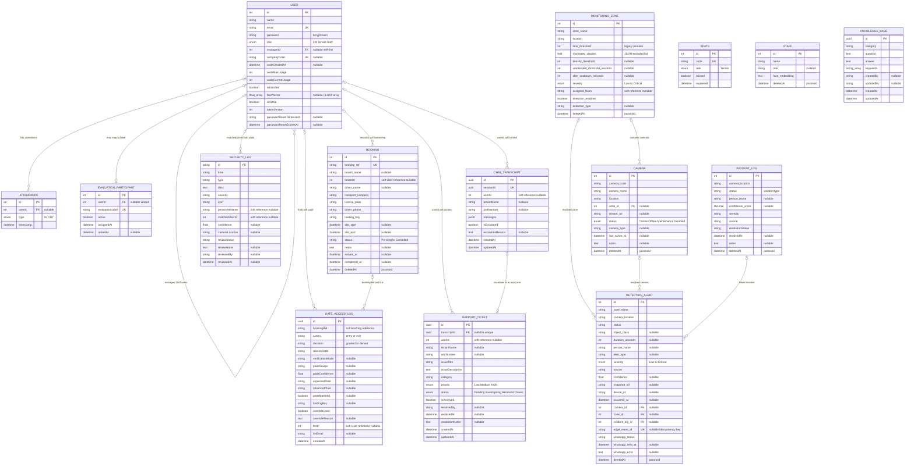

# FlowGuard entity-relationship diagram

This group-level diagram reflects the current Sequelize models and additive migrations. It shows workflow-relevant fields and real database/association links while omitting most timestamps and technical indexes for readability.

```mermaid
erDiagram
  USER o|--o{ USER : "manages Staff users"
  USER o|--o{ ATTENDANCE : "has attendance"
  USER o|--o| EVALUATION_PARTICIPANT : "may map to label"
  USER o|--o{ BOOKING : "tenantId soft ownership"
  USER o|--o{ GATE_ACCESS_LOG : "fmId soft audit"
  USER o|--o{ SECURITY_LOG : "matchedUserId soft audit"
  USER o|--o{ CHAT_TRANSCRIPT : "userId soft context"
  USER o|--o{ SUPPORT_TICKET : "userId soft context"
  BOOKING o|--o{ GATE_ACCESS_LOG : "bookingRef soft link"
  MONITORING_ZONE o|--o{ CAMERA : "contains cameras"
  MONITORING_ZONE o|--o{ DETECTION_ALERT : "resolved zone"
  CAMERA o|--o{ DETECTION_ALERT : "resolved camera"
  INCIDENT_LOG o|--o{ DETECTION_ALERT : "linked incident"
  CHAT_TRANSCRIPT o|--o| SUPPORT_TICKET : "escalates to at most one"

  USER {
    int id PK
    string name
    string email UK
    string password "bcrypt hash"
    enum role "FM Tenant Staff"
    int managerId FK "nullable self-link"
    string companyCode UK "nullable"
    datetime codeCreatedAt "nullable"
    int codeMaxUsage
    int codeCurrentUsage
    boolean isEnrolled
    float_array faceVector "nullable FLOAT array"
    boolean isActive
    int tokenVersion
    string passwordResetTokenHash "nullable"
    datetime passwordResetExpiresAt "nullable"
  }

  ATTENDANCE {
    int id PK
    int userId FK "nullable"
    enum type "IN OUT"
    datetime timestamp
  }

  EVALUATION_PARTICIPANT {
    int id PK
    int userId FK "nullable unique"
    string evaluationLabel UK
    boolean active
    datetime assignedAt
    datetime retiredAt "nullable"
  }

  SECURITY_LOG {
    string id PK
    string time
    string type
    text desc
    string severity
    string icon
    string personnelName "soft reference nullable"
    int matchedUserId "soft reference nullable"
    float confidence "nullable"
    string cameraLocation "nullable"
    string reviewStatus
    text reviewNotes "nullable"
    string reviewedBy "nullable"
    datetime reviewedAt "nullable"
  }

  INVITE {
    int id PK
    string code UK
    enum role "Tenant"
    boolean isUsed
    datetime expiresAt
  }

  STAFF {
    int id PK
    string name
    string role "nullable"
    text face_embedding
    datetime deletedAt "paranoid"
  }

  BOOKING {
    int id PK
    string booking_ref UK
    string tenant_name "nullable"
    int tenantId "soft User reference nullable"
    string driver_name "nullable"
    string transport_company
    string license_plate
    string driver_phone
    string loading_bay
    datetime slot_start "nullable"
    datetime slot_end "nullable"
    string status "Pending to Cancelled"
    text notes "nullable"
    datetime arrived_at "nullable"
    datetime completed_at "nullable"
    datetime deletedAt "paranoid"
  }

  GATE_ACCESS_LOG {
    uuid id PK
    string bookingRef "soft Booking reference"
    string action "entry or exit"
    string decision "granted or denied"
    string reasonCode
    string verificationMode "nullable"
    string plateSource "nullable"
    float plateConfidence "nullable"
    string expectedPlate "nullable"
    string observedPlate "nullable"
    boolean plateMatched "nullable"
    string loadingBay "nullable"
    boolean overrideUsed
    text overrideReason "nullable"
    int fmId "soft User reference nullable"
    string fmEmail "nullable"
    datetime createdAt
  }

  MONITORING_ZONE {
    int id PK
    string zone_name
    string location
    int time_threshold "legacy minutes"
    text monitored_classes "JSON-encoded list"
    int density_threshold "nullable"
    int unattended_threshold_seconds "nullable"
    int alert_cooldown_seconds "nullable"
    enum severity "Low to Critical"
    string assigned_team "soft reference nullable"
    boolean detection_enabled
    string detection_type "nullable"
    datetime deletedAt "paranoid"
  }

  CAMERA {
    int id PK
    string camera_code
    string camera_name
    string location
    int zone_id FK "nullable"
    string stream_url "nullable"
    enum status "Online Offline Maintenance Disabled"
    string camera_type "nullable"
    datetime last_active_at "nullable"
    text notes "nullable"
    datetime deletedAt "paranoid"
  }

  DETECTION_ALERT {
    int id PK
    string zone_name
    string camera_location
    string status
    string object_class "nullable"
    int duration_seconds "nullable"
    string person_name "nullable"
    string alert_type "nullable"
    enum severity "Low to Critical"
    string source
    float confidence "nullable"
    string snapshot_url "nullable"
    string device_id "nullable"
    datetime occurred_at "nullable"
    int camera_id FK "nullable"
    int zone_id FK "nullable"
    int incident_log_id FK "nullable"
    string edge_event_id UK "nullable idempotency key"
    string whatsapp_status
    datetime whatsapp_sent_at "nullable"
    text whatsapp_error "nullable"
    datetime deletedAt "paranoid"
  }

  INCIDENT_LOG {
    int id PK
    string camera_location
    string status "incident type"
    string person_name "nullable"
    decimal confidence_score "nullable"
    string severity
    string source
    string resolutionStatus
    datetime resolvedAt "nullable"
    text notes "nullable"
    datetime deletedAt "paranoid"
  }

  CHAT_TRANSCRIPT {
    uuid id PK
    uuid sessionId UK
    int userId "soft reference nullable"
    string tenantName "nullable"
    string unitNumber "nullable"
    jsonb messages
    boolean isEscalated
    text escalationReason "nullable"
    datetime createdAt
    datetime updatedAt
  }

  SUPPORT_TICKET {
    uuid id PK
    uuid transcriptId FK "nullable unique"
    int userId "soft reference nullable"
    string tenantName "nullable"
    string unitNumber "nullable"
    string issueTitle
    text issueDescription
    string category
    enum priority "Low Medium High"
    enum status "Pending Investigating Resolved Closed"
    boolean isArchived
    string resolvedBy "nullable"
    datetime resolvedAt "nullable"
    text resolutionNotes "nullable"
    datetime createdAt
    datetime updatedAt
  }

  KNOWLEDGE_BASE {
    uuid id PK
    string category
    text question
    text answer
    string_array keywords
    string createdBy "nullable"
    string updatedBy "nullable"
    datetime createdAt
    datetime updatedAt
  }
```

## Relationship and lifecycle notes

- `User.managerId` is the declared self-association used for Tenant-to-Staff account ownership. `Attendance.userId` cascades on User deletion; `EvaluationParticipant.userId` is unique and becomes null when the linked User is removed.
- `Booking.tenantId`, `SecurityLog.matchedUserId`/`personnelName`, `GateAccessLog.bookingRef`/`fmId`, transcript/ticket `userId`, and `MonitoringZone.assigned_team` are application-level soft references, not declared Sequelize foreign-key associations.
- `DetectionAlert.incident_log_id` is the current nullable link to `IncidentLog`. It is not unique, although present ingest workflows transactionally create one alert/incident pair. Linked lifecycle changes and paranoid deletion are synchronised in route code.
- `DetectionAlert.edge_event_id` is unique when present. A SecurePi retry with the same stable ID returns the existing record rather than creating another alert, incident, or notification.
- `DetectionAlert.whatsapp_status`, `whatsapp_sent_at`, and `whatsapp_error` retain the edge security-notification outcome independently of the committed alert.
- `IncidentLog.resolvedAt` is stamped on terminal transitions and cleared when an incident reopens. Older terminal incidents without this migration-era timestamp are excluded from MTTR rather than assigned an invented resolution time.
- `SupportTicket.transcriptId` is nullable and unique, matching the one-to-zero/one transcript relationship. Current fields support category, `Pending`/`Investigating`/`Resolved`/`Closed`, reversible archive, resolution metadata, and transactional ticket/transcript deletion.
- Paranoid models are `Booking`, `Staff`, `Camera`, `MonitoringZone`, `DetectionAlert`, and `IncidentLog`. Normal booking cancellation uses status `Cancelled`; it is not a destructive delete.
- `Staff` (`staff_members`) is a separate legacy biometric record with `face_embedding`; current role-based accounts use the self-linked `User` model.
- No facial, QR, plate, or continuous-video column exists. `snapshot_url` is optional alert metadata backed by authenticated temporary server storage or an external/local source, not a durable Cloud SQL image.

The matching PNG is generated from this Mermaid source at `design/png/er-diagram.png`.
