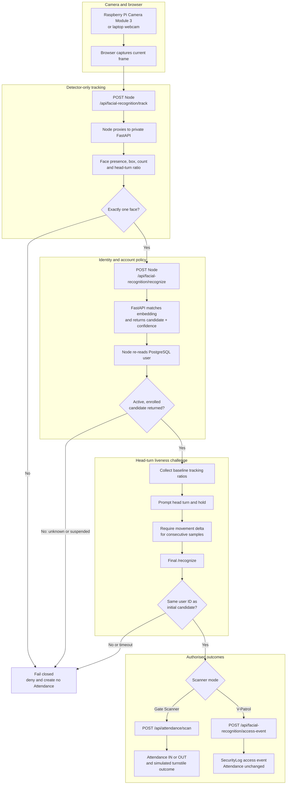
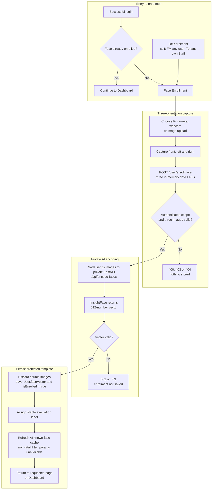
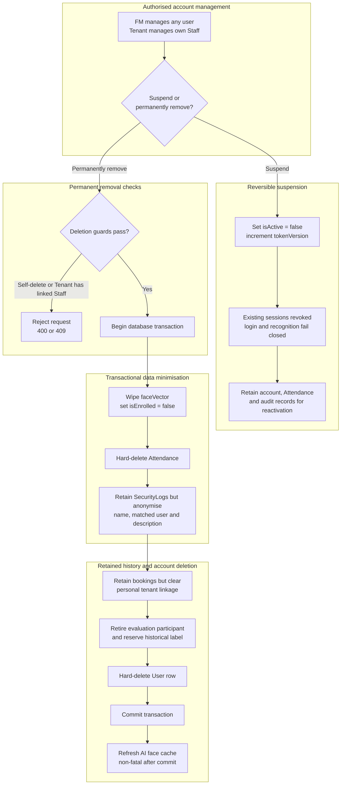

# FlowGuard - Facial Recognition & Access Management Flow

## Recognition flow

Motion liveness uses head-turn verification. It is a proof-of-concept challenge, not a complete anti-spoofing model.

## Enrolment flow

## Off-boarding flow

## Notes

- Tracking (`/api/facial-recognition/track`) is detector-only and has no identity, database, Attendance or SecurityLog side effects.
- Recognition (`/api/facial-recognition/recognize`) uses the AI match and confidence result, then treats the PostgreSQL user ID, active state and enrolment state as authoritative.
- Gate Scanner performs tracking, initial recognition, a baseline head-turn challenge, final same-ID recognition and then `/api/attendance/scan`.
- V-Patrol applies the same access policy but writes `/api/facial-recognition/access-event`; Attendance is unchanged.
- Unknown, suspended, multiple-face and timeout cases fail closed. Where the recognition/access routes audit a denial, they write `SecurityLog` access or intrusion events, not `IncidentLog` records.
- Enrolment images remain in request memory and are not written to PostgreSQL, disk, cloud storage or logs; only the generated biometric vector is stored.
- Suspension is reversible and retains records. Permanent off-boarding is transactional: the user and Attendance rows are hard-deleted, while operational/security history is retained only after unlinking or anonymisation.
