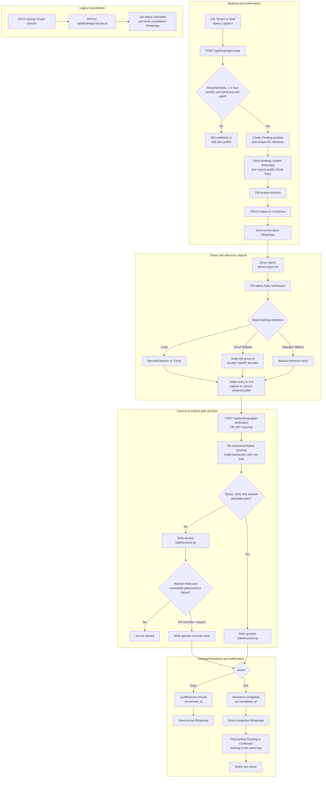
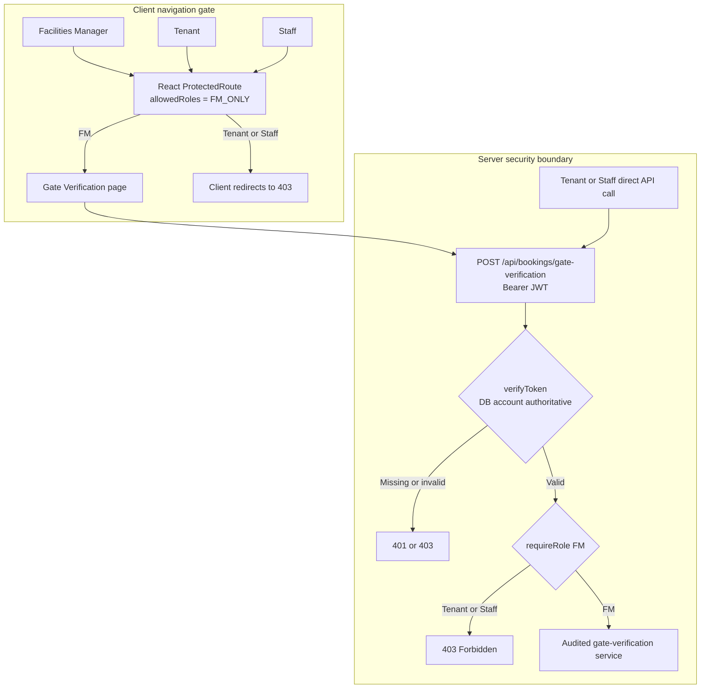

# FlowGuard - Smart Logistics & Loading Bay Flow

## Booking to gate to next-in-line

## Role gate on canonical Gate Verification

## Notes

- Booking creation is available to FM, Tenant and Staff, validates required fields and a one-to-two-hour booking window, rejects same-bay slot conflicts, and creates a `Pending` booking with a unique public Driver Pass reference.
- An FM changes the booking to `Confirmed` before canonical entry verification can grant access. Both creation and confirmation notifications are mock-safe when the real WhatsApp provider is not configured.
- QR decoding only proposes a booking reference. Local browser decoding is attempted first, the authenticated Node QR proxy may call private FastAPI as a fallback, and the gate-verification service always re-reads PostgreSQL before deciding.
- Canonical gate verification is FM-authoritative. It checks status and plate for entry/exit, also checks the arrival window for entry, audits every final decision, and allows only reviewable manual plate/camera failures to be overridden with a reason.
- Granted audits are written before state changes; an audit failure rolls back and fails closed. Repeated arrival/completion requests are idempotent.
- Gate exit sets `status = Completed` and `completed_at`, then locates the earliest eligible `Pending` or `Confirmed` booking in the same bay for notification.
- Cancellation is logical cancellation through status, not a database soft delete. The older `PATCH /:ref/gate-scan` compatibility route is not the canonical audited workflow.
- Plate OCR and the on-screen barrier are proof-of-concept simulations rather than physical access-control hardware.
