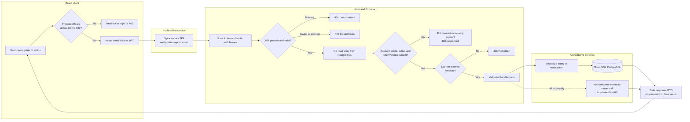
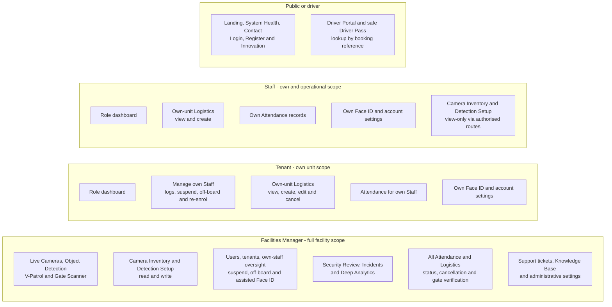

# FlowGuard - Role-Based Access Control (RBAC)

## Request flow

## Role capability map

## Access matrix

| Page / action | FM | Tenant | Staff | Public |
|---|:---:|:---:|:---:|:---:|
| Landing / health / contact / authentication | Yes | Yes | Yes | Yes |
| Driver Portal and Driver Pass `/driver-pass/:ref` | Yes | Yes | Yes | Yes |
| Dashboard | Yes | Yes | Yes | No |
| Own Face ID enrolment / re-enrolment | Yes | Yes | Yes | No |
| Assisted Face ID re-enrolment | any user | own Staff | No | No |
| Live Cameras / Object Detection / V-Patrol / Gate Scanner | Yes | No | No | No |
| Camera Inventory / Detection Setup | read/write | No | view-only | No |
| Daily Attendance | all | own Staff | own only | No |
| Logistics - view / create | all | own unit | own unit | No |
| Logistics - edit / cancel | all | own | No | No |
| Logistics - status changes / canonical Gate Verification | Yes | No | No | No |
| Own Staff management | facility oversight | own Staff | No | No |
| User and tenant administration | Yes | No | No | No |
| Security Review / Incidents / Deep Analytics | Yes | No | No | No |
| Support Dashboard / Knowledge Base administration | Yes | No | No | No |
| Administrative settings | Yes | No | No | No |

## Notes

- React `ProtectedRoute` provides navigation-level gating, but Express `verifyToken` plus `requireRole` is the security boundary. Direct API calls cannot bypass the server role gate.
- `verifyToken` treats the database as authoritative for account existence, active state, role and `tokenVersion`; stale JWT claims do not override current PostgreSQL state.
- **401** means credentials are missing, revoked or reference a deleted account. **403** means the token is invalid/expired, the account is suspended or the current database role lacks permission.
- Staff can directly access `/camera-inventory` and `/detection-settings` and the corresponding read APIs, but create/update/delete controls and endpoints remain FM-only. Those Staff routes are not currently advertised in the Sidebar.
- Tenant and Staff data reads are scoped server-side to their own unit or account where applicable; hiding a sidebar item is never relied on as authorization.
- FM accounts are provisioned through setup/seed operations and cannot be created from the application UI.
