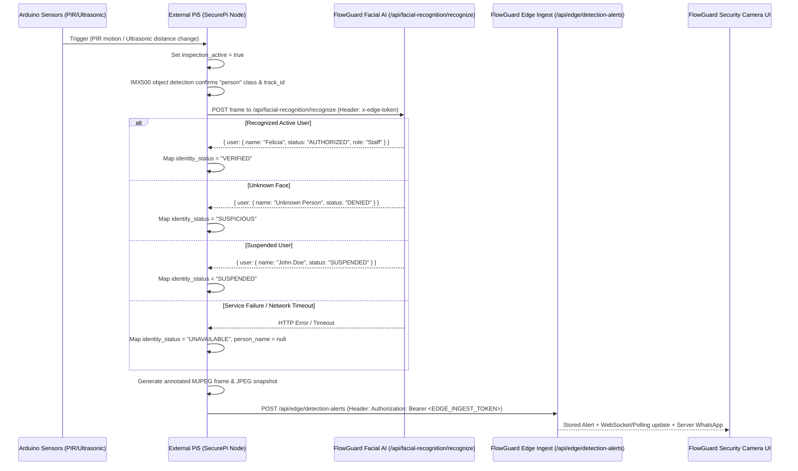

# Pi5 Sensor & Identity Integration Contract

This document specifies the exact contract and operational requirements for the external **`updated_securePi_FlowGuard`** repository running on the Raspberry Pi 5 node.

> [!IMPORTANT]
> The FlowGuard core repository is fully configured and ready to ingest sensor-triggered facial recognition events. The Pi5 edge node operates as an external producer to FlowGuard's edge API endpoints.

---

## 1. High-Level Event Flow & Physical Pipeline



---

## 2. API Credentials & Token Separation

The external Pi5 node requires **two separate credentials** for distinct operational purposes:

| Purpose | FlowGuard Endpoint | Required Header | Environment Variable Name |
| :--- | :--- | :--- | :--- |
| **Facial Recognition** | `POST /api/facial-recognition/recognize` | `x-edge-token: <EDGE_SERVICE_TOKEN>` | `EDGE_SERVICE_TOKEN` |
| **Alert Ingestion** | `POST /api/edge/detection-alerts` | `Authorization: Bearer <EDGE_INGEST_TOKEN>` | `EDGE_INGEST_TOKEN` |

> [!CAUTION]
> Do **NOT** combine or swap these tokens. The facial recognition route checks `x-edge-token`, whereas the detection alert route checks the HTTP `Bearer` authorization token.

---

## 3. Facial Recognition Contract (`POST /api/facial-recognition/recognize`)

### Request
- **URL**: `http://<flowguard-host>:5001/api/facial-recognition/recognize`
- **Method**: `POST`
- **Headers**:
  - `Content-Type: application/json`
  - `x-edge-token: <EDGE_SERVICE_TOKEN>`
- **Body**:
  ```json
  {
    "image": "data:image/jpeg;base64,...",
    "cameraLocation": "Loading Bay Camera 01"
  }
  ```

### Response Mapping Matrix

| Node / InsightFace Response | Pi5 `person_name` | Pi5 `identity_status` | Default FlowGuard Severity |
| :--- | :--- | :--- | :--- |
| `status: "AUTHORIZED"` | Enrolled User Name (e.g. `"Felicia"`) | `VERIFIED` | `High` |
| `status: "DENIED"` (Unknown face) | `"Unknown Person"` | `SUSPICIOUS` | `Critical` |
| `status: "SUSPENDED"` | Enrolled User Name (e.g. `"John Doe"`) | `SUSPENDED` | `Critical` |
| Service Error / Timeout / 503 | `null` | `UNAVAILABLE` | `High` |

> [!IMPORTANT]
> If facial recognition fails or times out, set `identity_status = "UNAVAILABLE"` and `person_name = null`. **Never map `UNAVAILABLE` to `UNKNOWN`**.

---

## 4. Edge Alert Ingestion Contract (`POST /api/edge/detection-alerts`)

### Request Specifications
- **URL**: `http://<flowguard-host>:5001/api/edge/detection-alerts`
- **Method**: `POST`
- **Headers**:
  - `Authorization: Bearer <EDGE_INGEST_TOKEN>`
  - `Content-Type: multipart/form-data` (when uploading JPEG snapshot) or `application/json`

### Field Schema

```json
{
  "event_id": "securepi-bay1-person-trk3-1786137000",
  "event_type": "restricted_motion",
  "alert_type": "Restricted-Zone Motion",
  "object_class": "person",
  "person_name": "Felicia",
  "identity_status": "VERIFIED",
  "person_role": "Staff",
  "track_id": 3,
  "confidence": 0.91,
  "device_id": "securepi-node-01",
  "zone_name": "Restricted Loading Bay",
  "camera_location": "Loading Bay Camera 01",
  "sensor_metadata": {
    "pir": true,
    "motion": true,
    "pir_ready": true,
    "distance_cm": 42.5,
    "baseline_distance_cm": 120.0,
    "distance_change_cm": 77.5,
    "object_close": true,
    "trigger": "PIR",
    "inspection_active": true,
    "after_hours": true
  },
  "timestamp": "2026-08-08T04:00:00Z"
}
```

### Idempotency Requirements
- Every detection occurrence **MUST** include a unique, deterministic `event_id` (e.g. `<device_id>:<alert_type>:<track_id>:<timestamp_sec>`).
- If Wi-Fi drops and the Pi5 retries the HTTP POST, sending the identical `event_id` ensures FlowGuard acknowledges the retry (`200 OK`) without creating duplicate alerts or duplicate WhatsApp notifications.

### Snapshot Requirements
- Attach a JPEG snapshot as a multipart field named `snapshot` (extension `.jpg` or `.jpeg`).
- FlowGuard stores the snapshot securely and serves it to the Security Camera UI.

> [!WARNING]
> The Pi5 node must **NEVER** issue WhatsApp messages directly. WhatsApp delivery is owned entirely by the FlowGuard server pipeline upon alert ingestion.

---

## 5. Expected Pi5 Telemetry Endpoints

The Security Camera UI polls the Pi5 device directly for live feed diagnostics and sensor telemetry. The Pi5 application should expose:

1. **`GET /sensor_status`** *(Recommended)*
   - Returns: `200 OK`
   - Body:
     ```json
     {
       "connected": true,
       "pir_ready": true,
       "pir": true,
       "motion": true,
       "distance_cm": 42.5,
       "baseline_distance_cm": 120.0,
       "distance_change_cm": 77.5,
       "object_close": true,
       "trigger": "PIR",
       "inspection_active": true,
       "inspection_remaining_seconds": 10,
       "after_hours": true,
       "inspection_id": "pi5-cycle-1786137000"
     }
     ```
   - Note: Exposing a top-level `inspection_id` / `inspection_cycle_id` allows cross-device hardware correlation.
2. **`GET /health`**
   - Returns: `200 OK`
   - Body: `{"status": "online", "camera": "IMX500", "streaming": true, "latest_frame_age_seconds": 0.2, "sensor": {...}}`
3. **`GET /video_feed`**
   - Returns: Annotated MJPEG stream (`multipart/x-mixed-replace`).
4. **`GET /people-count`** *(Optional)*
   - Body: `{"count": 1, "detection_active": true}`

---

## 6. Physical Integration Testing Checklist

When deploying the `updated_securePi_FlowGuard` software to the Pi5 hardware:

- [ ] Connect Arduino Uno (PIR + Ultrasonic) via USB/serial to Pi5.
- [ ] Confirm PIR motion detection sets `inspection_active = true`.
- [ ] Verify IMX500 detects person bounding box and assigns continuous `track_id`.
- [ ] Verify Pi5 crops face region and sends POST to `http://<server>:5001/api/facial-recognition/recognize` using `x-edge-token`.
- [ ] Verify recognized staff user maps to `identity_status: "VERIFIED"`.
- [ ] Verify unrecognized face maps to `identity_status: "SUSPICIOUS"` and `person_name: "Unknown Person"`.
- [ ] Verify server network disconnection sets `identity_status: "UNAVAILABLE"` and `person_name: null`.
- [ ] Confirm alert POST to `http://<server>:5001/api/edge/detection-alerts` using `Authorization: Bearer <EDGE_INGEST_TOKEN>`.
- [ ] Confirm FlowGuard Security Camera UI displays Identity, Role, Classification, PIR, Ultrasonic, Track ID, and Snapshot correctly.
