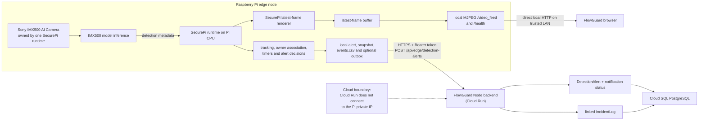

# SecurePi Edge AI Integration for FlowGuard

## Overview

SecurePi is a separate Raspberry Pi edge-AI subsystem that supports FlowGuard's object-detection, alert, and incident workflows. Its source is maintained in dedicated repositories so the team avoids duplicated projects and stale dependency copies, while hardware, model, and runtime development can proceed independently of the web platform. FlowGuard retains the backend ingestion route, alert and incident models, browser integration, and this architecture documentation.

Removing copied SecurePi folders from this repository did not remove the feature. It removed duplicate source copies; SecurePi remains part of the system architecture and is integrated over documented local-network and cloud API boundaries.

This review reflects the four repositories' current default branches on 3 August 2026. Repository content, tests, README claims, and latest commit metadata were compared; similarly named repositories were not assumed to be identical.

## Repository References

| Repository | Purpose | Relationship/status |
|---|---|---|
| [charlisaa/SecurePi](https://github.com/charlisaa/SecurePi) | IMX500 person/bag unattended-object runtime, annotated MJPEG stream, health endpoint, and a simple FlowGuard alert bridge. | Fork of `keatkean/SecurePi`; current specialised stream-enabled variant. Latest reviewed commit: 31 July 2026. It has two off-device test files. Failed FlowGuard posts are logged and dropped; there is no crash-safe disk outbox. |
| [feliciatanxl/SecurePi](https://github.com/feliciatanxl/SecurePi) | Earlier IMX500 person/bag unattended-object runtime with preview/headless operation, snapshots, and CSV events. | Fork of `keatkean/SecurePi`; historical precursor. Latest reviewed commit: 8 July 2026. It has one off-device test file and no FlowGuard bridge or MJPEG server. |
| [feliciatanxl/SecurePi2](https://github.com/feliciatanxl/SecurePi2) | Desktop/training pipeline for dataset preparation, dataset verification, YOLO training, ONNX export, IMX500 compilation, and a GUI. | Fork of `keatkean/SecurePi2`; historical training precursor whose main functions are incorporated into the combined repository. Latest reviewed commit: 27 July 2026. No tests are present. |
| [feliciatanxl/SecurePi_FlowGuard](https://github.com/feliciatanxl/SecurePi_FlowGuard) | Combined edge runtime, six-class training pipeline, Camera Module 3 development path, FlowGuard disk outbox/API client, sensor bridge, deployment examples, models documentation, and off-device tests. | Standalone combined repository and the **recommended canonical reference** based on the reviewed scope and latest commit history. Latest reviewed commit: 1 August 2026. It has eight Python test files. Its IMX500 runtime does not currently contain the MJPEG/health server from `charlisaa/SecurePi`. |

The recommended canonical reference is `feliciatanxl/SecurePi_FlowGuard` because it is the newest and most comprehensive reviewed repository. `charlisaa/SecurePi` remains the authoritative source for the current one-process IMX500 MJPEG implementation. The hardware owner should confirm this ownership decision and either port the stream feature into the canonical repository or explicitly maintain the stream variant as a supported branch of the architecture.

## Hardware Architecture

The combined repository supports Raspberry Pi 4, Raspberry Pi 5, or Pi Zero 2 W running 64-bit Raspberry Pi OS Bookworm with the Raspberry Pi AI Camera built on the Sony IMX500 sensor over CSI. The team's intended final configuration is Raspberry Pi 5 plus IMX500. The IMX500 is an intelligent vision sensor with its own neural-network pipeline; it is not a normal webcam, and the IMX500 path must not be described as CPU inference on an ordinary camera.

The main responsibilities are separated as follows:

| Component | Confirmed responsibility |
|---|---|
| Sony IMX500 | Captures the image and runs the loaded object-detection network through the IMX500 edge pipeline. |
| Raspberry Pi CPU | Runs Picamera2/SecurePi, reads inference metadata, tracks people/objects/pests, evaluates alert rules, renders annotations, writes local evidence, and sends events. It does not run the IMX500 model itself. |
| SecurePi runtime | Sole owner of the IMX500 camera, edge decision engine, local evidence manager, and optional FlowGuard event client. |
| Optional Arduino/sensors | The combined repository includes a serial sensor bridge for PIR and ultrasonic restricted-motion events. It does not own the camera and may run beside the SecurePi runtime. |
| Trusted Wi-Fi/hotspot | Carries the browser-to-Pi local stream and Pi-to-cloud/laptop backend requests during a demonstration. |
| FlowGuard browser | Reads a configured local stream directly while on the same trusted network; it does not ask Cloud Run to proxy the Pi's private address. |
| FlowGuard backend | Authenticates edge events, creates alerts and incidents, records notification state, and exposes the results to authorised users. |
| Cloud SQL PostgreSQL | Stores FlowGuard alert, incident, link, and notification metadata. It does not receive the live camera stream. |

The combined repository also documents a Raspberry Pi 4 plus Camera Module 3 development path that runs `best.pt` on the Pi CPU. That is useful for validating shared tracking and integration logic, but it is not the final Pi 5 plus IMX500 architecture and cannot validate `.rpk` loading or IMX500 output parsing.

## Why the Sony IMX500 Is Used

The IMX500 executes the loaded detection network through its edge inference pipeline. SecurePi reads detection tensors from Picamera2 frame metadata and performs tracking and alert decisions on the Pi. It therefore does not need to upload every frame to a cloud AI service.

This design reduces continuous video bandwidth, avoids a cloud round trip for each inference decision, and permits local tracking, snapshots, and event logging during a temporary backend outage. Only selected alert metadata and, where an interoperable evidence-upload path exists, selected evidence need to leave the device. The reviewed repositories do not provide benchmark evidence for a specific latency, throughput, bandwidth percentage, or accuracy claim, so no numerical performance claim is made here.

## Detection Capabilities

| Category | Classes | Edge behaviour |
|---|---|---|
| Person | `person` | Stable position-based tracks; a nearby person may be adopted as an object's owner during the owner-claim window. Available in the stock COCO and custom six-class configurations. |
| Unattended object | `backpack`, `handbag`, `suitcase` | Stable object tracks, owner association, unattended timer, cooldown, annotated snapshot, CSV event, and optional FlowGuard event. Available in the stock COCO and custom configurations. |
| Pest | `rat`, `mouse` | Separate confirmation and cooldown logic with no owner association. These classes require the custom six-class model and a compatible compiled `.rpk` plus parser. |

The custom FlowGuard class order is `person`, `backpack`, `handbag`, `suitcase`, `rat`, `mouse`, and the labels file must use the model's exact index order. The stock COCO SSD/NanoDet models provide `person` and the three bag classes. They do not provide a rodent `rat` class, and COCO `mouse` means a computer mouse. Rodent detection is therefore not meaningful with the stock model.

## Unattended-Object Logic

The combined and person/bag runtime code implements this sequence:

1. The IMX500 produces person and object detections above `--min-confidence` (default `0.5`).
2. SecurePi associates detections into stable person and object tracks. `--stationary-radius` (default `120` pixels) is the object association radius, and `--timeout` (default `10` seconds) is the coasting window for temporary detection loss.
3. During `--owner-claim-time` (default `3` seconds), a person within `--proximity` (default `150` pixels at the default 640x480 frame size) may be adopted as that object's owner.
4. Only the adopted owner being near the object resets its unattended timer. A passer-by does not reset the timer, and an object that arrived with no owner cannot later be claimed under the current rule.
5. If the owner moves away or disappears, the unattended timer advances while the track remains valid.
6. When it reaches `--unattended-time` (default `120` seconds), the object enters the alert state.
7. Repeat alerts for the same tracked object are limited by `--alert-cooldown` (default `30` seconds).
8. SecurePi writes a local annotated snapshot and event row.
9. If the combined FlowGuard client is enabled, it queues a stable event for authenticated submission; otherwise local operation continues.

All pixel thresholds depend on the configured frame size and viewpoint. The position-based tracker is not biometric person re-identification and does not follow an owner across cameras.

## Pest-Detection Logic

The combined repository routes `rat` and `mouse` into a dedicated `PestTracker`; they never enter the unattended-object or owner logic. A pest uses `--pest-confidence` (default `0.50`) and is confirmed after either `--pest-confirmation-time` (default `2` seconds) or `--pest-confirmation-frames` (default `3` consecutive frames). A confirmed pest can alert again only after `--pest-alert-cooldown` (default `30` seconds).

This logic, class separation, confirmation, snapshots, event generation, and cooldown have off-device tests. Physical rodent detection with the custom model on Pi 5 plus IMX500 has not been validated. The custom model/parser issue described below must be resolved before pest detection can be presented as a successful IMX500 live result.

## Edge Processing Architecture



The MJPEG branch in this diagram is implemented by `charlisaa/SecurePi`, using the same SecurePi process and Picamera2 instance as detection. The recommended combined repository does not yet contain that server. It must be ported or the specialised repository must be used; starting a second IMX500 camera process is not a valid workaround because only one process should own the camera.

## Local Outputs

| Output | Verified implementation and boundary |
|---|---|
| Annotated preview | Both IMX500 runtime lines draw tracked boxes, state, and timers in preview mode. |
| Headless mode | Both runtime lines support `--headless`; alert-time annotation/evidence remains available. |
| Snapshots | Alert JPEGs are written locally. The combined runtime uses `runtime/snapshots/[zone]`; the stream variant defaults to `alerts/`. |
| Event log | The combined runtime appends `runtime/logs/events.csv` with time, event type, label, confidence, track ID, zone, duration, and snapshot filename. The earlier runtime uses a smaller CSV schema. |
| Retention | `--max-snapshots` defaults to `500`; the oldest alert snapshots are pruned. |
| Crash-safe outbox | The combined repository atomically writes JSON under its runtime outbox, retries retryable failures at startup/intervals, retains auth/config failures, and dead-letters permanent/corrupt events. |
| MJPEG stream | `charlisaa/SecurePi --stream` publishes the latest annotated frame at `/video_feed` (default port `8001`, default stream rate `8` FPS and JPEG quality `70`). Slow clients receive the latest frame rather than growing a queue. |
| Health endpoint | The same stream variant exposes `/health` with IMX500/stream state. |
| Snapshot HTTP endpoint | The stream-enabled IMX500 runtime does **not** expose `/snapshot`. FlowGuard's `/snapshot` integration belongs to the separate `raspberry-pi/pi_camera_steam.py` Camera Module 3 service. |
| Simple alert queue | `charlisaa/SecurePi` uses a bounded in-memory queue and a five-second HTTP timeout. A failed request is dropped, not persisted or retried. |

The combined client contains a best-effort call to `POST /api/edge/snapshots`, but the current FlowGuard backend has no such route. FlowGuard instead accepts a JPEG named `snapshot` in the same multipart request as `POST /api/edge/detection-alerts`; the combined client sends a separate field named `file` and then JSON. Therefore current cross-repository snapshot upload is **not interoperable and must not be claimed as working**. Metadata alerts, local snapshots, and the disk event outbox remain independent of that mismatch.

## FlowGuard Integration

### SecurePi

Depending on the selected repository variant, SecurePi is responsible for:

- exclusive IMX500/Picamera2 ownership;
- on-sensor inference configuration and metadata decoding;
- person, object, and pest tracking;
- owner association and alert decisions;
- deterministic `event_id` generation in the combined repository;
- local snapshots, CSV evidence, retention, and a crash-safe event outbox in the combined repository;
- authenticated submission with `Authorization: Bearer <token>` to the configured FlowGuard backend; and
- the annotated local MJPEG/health service in the specialised `charlisaa/SecurePi` variant.

The simple stream variant does not send an `event_id` and has no disk outbox, so FlowGuard's idempotency guarantee is not activated for that sender. The combined variant supplies a deterministic ID and reuses it across retries.

### FlowGuard backend

Current FlowGuard code confirms:

- `POST /api/edge/detection-alerts` is mounted under `/api/edge` and fails closed when `EDGE_INGEST_TOKEN` is unset;
- the route requires the token in an `Authorization: Bearer ...` header and ignores a caller-supplied `source`, assigning `SecurePi Edge Node` itself;
- `event_id`, when present, is validated and used as the unique `edge_event_id`; duplicates return the existing alert instead of creating another alert or incident;
- a new `DetectionAlert` and `IncidentLog` are created atomically, and `DetectionAlert.incident_log_id` links them;
- status, type-aware/default severity, object class, confidence, device, occurrence time, resolved camera, and resolved zone are stored where the schema supports them;
- `track_id` and `sensor_metadata` are accepted for safe logging/notification context but are not persisted as dedicated alert columns;
- security WhatsApp delivery is a separate, post-commit action. Its `Not Requested`, `Pending`, `Sent`, `Failed`, `Skipped`, or `Simulated` state is stored on the alert, and a notification failure never rolls back an alert;
- authorised FM/Staff users retrieve alerts through `/api/detection-alerts`, and the Object Detection page exposes alert, incident, snapshot, severity, source, and WhatsApp state; and
- uploaded evidence, when sent in FlowGuard's supported multipart shape, is stored on ephemeral instance-local storage and served to authorised users through `/api/detection-alerts/:id/snapshot/:filename`. It is not durable cloud object storage.

### FlowGuard browser

FlowGuard has two distinct local-camera integrations:

1. The Object Detection page resolves an absolute SecurePi stream from the selected Camera Inventory record's `stream_url`, then from `VITE_SECUREPI_STREAM_URL`. It reads `/video_feed` directly in an image element and probes `/health` directly from the user's browser on the same local network. Cloud Run does not fetch that private stream. The page also derives `/people-count`, but neither reviewed IMX500 runtime currently provides that endpoint; the page therefore cannot show a live SecurePi count without an additional compatible endpoint.
2. Gate Scanner, V-Patrol, Facial Evaluation, Face Enrolment, and Settings use a runtime base URL stored as `flowguard.piCameraBaseUrl` or the `VITE_PI_CAMERA_*` build values. They probe `/health`, show `/video_feed`, and capture `/snapshot` from `raspberry-pi/pi_camera_steam.py`. That service identifies itself as **Pi Camera Module 3**, not IMX500. Those pages fall back to the laptop webcam where implemented.

The browser-to-Pi path is local plain HTTP. A deployed HTTPS browser may require local-network permission and may be affected by private-network or mixed-content policy. No real token belongs in a `VITE_` variable or browser storage.

## Example Edge Alert Payload

The following sanitised example uses fields accepted by both the combined SecurePi event builder and FlowGuard's current edge route. The combined sender uses `timestamp`; FlowGuard also accepts `occurred_at`, but it is omitted here because the sender does not need both.

```json
{
  "event_id": "securepi-loading-bay-01:unattended_object:12:20260803T010203Z",
  "zone_name": "Loading Bay",
  "camera_location": "Loading Bay Camera 01",
  "alert_type": "Unattended Object",
  "object_class": "backpack",
  "confidence": 0.88,
  "duration_seconds": 125,
  "device_id": "securepi-loading-bay-01",
  "track_id": 12,
  "timestamp": "2026-08-03T01:02:03Z"
}
```

`severity` is optional; when it is omitted, FlowGuard applies its server-side type/duration policy. `sensor_metadata` may be an object for sensor-bridge events. `source` is intentionally omitted because FlowGuard ignores an edge-supplied value and assigns the authenticated edge source. A local `snapshot_path` may be included as metadata, but it is not a browser URL and does not upload the file.

## Model Training Pipeline

The combined repository implements this off-device workflow:

```text
dataset preparation -> dataset verification -> YOLOv8-n training -> ONNX export
-> Sony IMX500 compilation -> .rpk + labels copied to Pi -> SecurePi loads model
```

Dataset preparation, training, export, and compilation run on a computer or Colab, not on the Pi. The compilation tooling targets Python 3.8-3.11, checks the converter exit status, requires a non-empty output file, and does not create a fake placeholder `.rpk` on failure.

The stock option is a precompiled COCO SSD MobileNetV2 or NanoDet `.rpk` installed with the IMX500 packages. It supports people and bags with the current parser. The custom FlowGuard option is trained for the six listed classes and requires its matching labels plus a successfully compiled and runtime-compatible `.rpk`.

The combined repository's model documentation says generated weights and compiled artifacts should not be committed, but the reviewed default branch currently tracks `models/best.pt`. The team should reconcile the repository with its documented model-artifact policy; no model file is copied into FlowGuard by this guide.

## Current Validation Status

| Capability | Status | Evidence/remaining work |
|---|---|---|
| Stock person/bag detection | Implemented | Stock SSD `_pp` and NanoDet formats are supported by the IMX500 parser; physical validation is still part of the final hardware run. |
| Unattended-object tracking | Tested off-device | Track matching, timing, cooldown, deduplication, and alert behaviour have unit/integration tests. |
| Owner association | Tested off-device | Stable person IDs, owner claim, owner-only reset, and bystander behaviour have tests; tune for the installed viewpoint. |
| Local snapshots/events | Tested off-device | Snapshot creation/pruning and CSV output have tests. Confirm file permissions and retention on the Pi. |
| Headless operation | Implemented | CLI and systemd configuration exist; perform a long-running Pi test. |
| MJPEG | Tested off-device | Latest-frame buffer, multipart output, disconnect handling, and shutdown are tested in `charlisaa/SecurePi`; not present in the combined repository. |
| Health endpoint | Tested off-device | `/health` is tested in the stream variant; not present in the combined repository. |
| FlowGuard alert bridge | Tested off-device | Payload/header and failure-isolation tests exist; run an end-to-end request against the intended FlowGuard environment without exposing tokens. |
| Retry/outbox | Tested off-device | Combined repository tests cover atomic queueing, stable IDs, retries, permanent errors, and sensor events. The stream variant does not have this outbox. |
| Pest tracking | Tested off-device | Class separation, confidence, time/frame confirmation, cooldown, snapshot, and event tests exist; physical rodent detection is not validated. |
| Custom YOLO training | Implemented | Pipeline code and a weight artifact are present; dataset quality, accuracy, and reproducibility were not established by this repository review. |
| ONNX export | Implemented | Export code exists; no reviewed ONNX artifact or recorded end-to-end export result establishes current reproducibility. |
| `.rpk` compilation | Experimental | Compilation and failure checks exist, but no compiled `.rpk` or successful converter run is present in the reviewed repository. Hardware loading remains required. |
| Custom model output/parser compatibility | Not validated | Current parser handles SSD three-tensor `_pp` or NanoDet output, not a stock raw YOLOv8 tensor. A YOLO decode/NMS branch or a compatible post-processed output is required. |
| Physical Pi 5 + IMX500 validation | Hardware validation required | Load the exact `.rpk`, inspect tensor count/shape/metadata, validate boxes/labels/confidence, and exercise person, bag, pest, stream, and event flows on the intended hardware. |

A successful `.rpk` compilation proves packaging, not semantic runtime compatibility. It does not prove the tensor layout is decoded correctly, class labels align, boxes scale correctly, confidence is meaningful, or non-maximum suppression is applied. The current custom YOLOv8 raw output requires decoding and class-wise NMS that the IMX500 runtime does not implement.

## Privacy and Security

- Keep inference edge-first and do not upload continuous video to FlowGuard.
- Treat the MJPEG service as local-only. The reviewed stream variant is unauthenticated plain HTTP with permissive CORS; use a trusted hotspot/LAN and never forward its port to the public internet.
- Use HTTPS for the Pi's outbound cloud API request and keep `EDGE_INGEST_TOKEN` outside Git, client-side `VITE_` values, shell history, screenshots, and documentation.
- Restrict the backend ingest route with its dedicated bearer token; do not reuse a user JWT, database password, or AI-service secret.
- Keep `runtime/`, snapshots, CSV logs, outbox records, captured images, datasets, and generated model artifacts outside FlowGuard Git. Do not commit captured people or private spaces.
- Enforce snapshot pruning and define an operational retention/deletion period for CSV events and outbox/dead-letter files as well as JPEGs.
- Remember that current FlowGuard snapshot storage is temporary instance-local storage, not a durable evidence archive.
- Obtain site approval, use signage/consent where appropriate, minimise the captured field of view, and restrict access to authorised Facilities Manager/security staff.
- Harden local streaming before any use beyond a controlled PoC: exact-origin CORS, network segmentation, service supervision, firewall rules, and an authenticated/encrypted local gateway where the risk requires it.

## Business Value for FlowGuard

SecurePi can reduce continuous manual surveillance by turning local person, unattended-object, and eventually pest detections into structured evidence and operational alerts. Local decisions enable faster incident initiation, automatic evidence logging, and continued monitoring during temporary backend disconnection. The FlowGuard backend then places confirmed edge events into the existing alert, incident, notification, and resolution workflows without requiring full-video cloud upload. These are workflow benefits; the reviewed repositories do not establish numerical savings or detection accuracy.

## Demo Workflow

1. Start the Raspberry Pi 5 and connected Sony IMX500; verify the OS can see the camera.
2. Start exactly one SecurePi runtime with the selected preset and model.
3. Show the annotated detections locally or through the one-process stream variant.
4. Place a supported bag near a person and show the owner/object association.
5. Move the adopted owner away while keeping the object visible.
6. Show the unattended timer advancing without a bystander resetting it.
7. Allow the configured threshold to trigger one alert and demonstrate the cooldown.
8. Show the local annotated snapshot and event log/outbox record.
9. With backend connectivity enabled, show the resulting alert in FlowGuard Object Detection.
10. Show the linked incident and notification status; do not represent a simulated WhatsApp result as a real delivery.
11. Demonstrate a prepared fallback where practical.

Fallback rules:

- If the custom model is unavailable or its parser is unvalidated, use the stock person/bag model and do not demonstrate pests.
- If the backend is unavailable, the combined repository retains the local event/outbox for retry; the `charlisaa/SecurePi` simple bridge does not, so show local evidence instead.
- If the Pi stream is unavailable, use FlowGuard's laptop webcam mode or prepared non-sensitive evidence. Do not start a second process that competes for the IMX500.
- If the pest model has not passed the physical test, describe pest logic as off-device tested and do not present it as a successful live detection.
- Because current snapshot-upload contracts do not match, demonstrate the alert metadata plus Pi-local evidence unless that contract has been reconciled and retested.

## Separation from Main FlowGuard Repository

SecurePi code lives in its dedicated repositories. FlowGuard contains integration documentation and platform support: the edge API, alert/incident/notification models, dashboard/browser views, and local-camera URL configuration. The removed SecurePi folders were duplicate copies, not the system's only implementation. SecurePi remains part of the architecture, and runtime, hardware, training, parser, or model changes should be made and reviewed in the canonical SecurePi repository rather than copied back into FlowGuard.

## Limitations and Future Work

- Resolve and physically validate the custom YOLOv8-to-IMX500 output contract. If the `.rpk` emits raw YOLO output, implement the correct decode, confidence filtering, box conversion, and class-wise NMS branch.
- Perform an end-to-end Pi 5 plus IMX500 run with the exact firmware, model, labels, presets, systemd configuration, and FlowGuard backend intended for the demo.
- Consolidate the one-process MJPEG/health implementation into the canonical repository, or formally designate and maintain the specialised stream variant.
- Reconcile evidence upload: the combined client currently calls `/api/edge/snapshots` with `file`, while FlowGuard accepts `snapshot` on `/api/edge/detection-alerts`. Until then, only local snapshot evidence is reliable.
- Either add a compatible `/people-count` endpoint or stop FlowGuard's Object Detection page from deriving/polling one for SecurePi variants that do not implement it.
- Treat `/snapshot` as a Camera Module 3 gate-camera capability unless it is deliberately added to the single-owner IMX500 runtime.
- Add deterministic event IDs and a crash-safe outbox to the stream variant if it remains supported; otherwise network failures can drop events and backend idempotency is not used.
- Expect occlusion, close tracks, camera motion, and changing viewpoints to affect position-based tracking. Owner association is proximity-based, not identity-based.
- Tune confidence, association, confirmation, time, and cooldown thresholds with representative site data while monitoring false positives and false negatives.
- Keep a verified stock `.rpk` fallback and manage custom model/label availability without committing large or sensitive artifacts to FlowGuard.
- Harden the unauthenticated, unencrypted local stream and the hotspot/network setup before moving beyond a controlled PoC.
