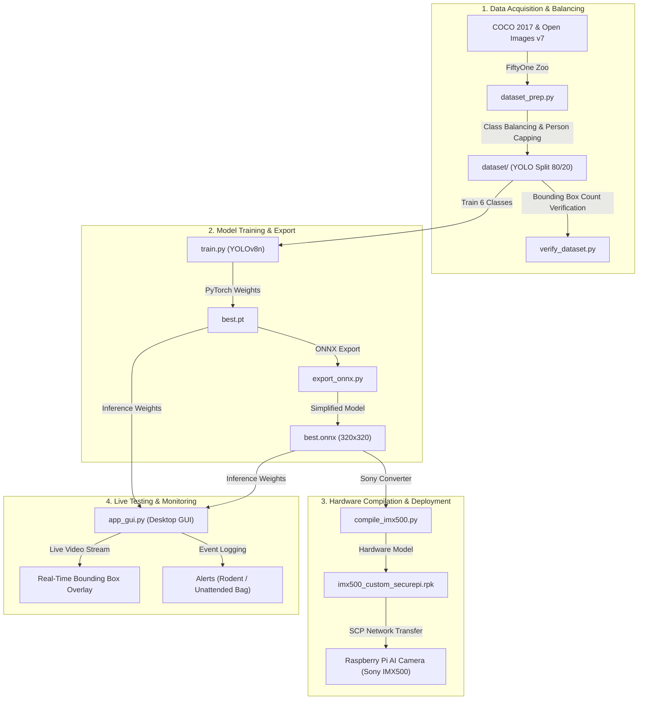

# 🛡️ SecurePi - Custom AI Model Training & Deployment Pipeline

**SecurePi** is an AI-powered security and pest detection system tailored for the **Raspberry Pi AI Camera (Sony IMX500)**. This repository provides an end-to-end pipeline to download datasets, fine-tune a multi-class YOLOv8 object detection model, convert it to ONNX, and compile it into a hardware-accelerated `.rpk` file for deployment on Raspberry Pi.

---

## 🎯 Target Classes

The custom model detects **6 target classes** mapped cleanly to indices `0..5`:

| Class ID | Name | Source Dataset | Category |
| :---: | :---: | :---: | :---: |
| `0` | `person` | COCO 2017 | Security |
| `1` | `backpack` | COCO 2017 | Unattended Object |
| `2` | `handbag` | COCO 2017 | Unattended Object |
| `3` | `suitcase` | COCO 2017 | Unattended Object |
| `4` | `rat` | Open Images v7 | Pest / Rodent |
| `5` | `mouse` | Open Images v7 | Pest / Rodent |

---

## 📁 Repository Structure

```text
SecurePi/
├── README.md                 <-- Main Project Documentation
├── LICENSE                   <-- MIT Open Source License
├── requirements.txt          <-- Python Package Dependencies
├── app_gui.py                <-- Desktop GUI Dashboard (Live Feed & Detection Boxes)
├── verify_dataset.py         <-- Dataset Audit & Class Count Verifier
├── run_pipeline.py           <-- Master Script (Runs Entire Pipeline)
├── dataset_prep.py           <-- Downloads & Prepares YOLO Dataset
├── train.py                  <-- Fine-tunes YOLOv8 Model (GPU / CPU)
├── export_onnx.py            <-- Exports PyTorch Model to ONNX
├── compile_imx500.py         <-- Compiles ONNX to IMX500 (.rpk)
├── implementation_plan.md    <-- Setup & Architecture Guide
└── venv311/                  <-- Python 3.11 Virtual Environment (Created for IMX500 converter)
```

---

## ⚠️ Python Version Compatibility

> [!IMPORTANT]
> **Required Python Version: Python 3.8 – Python 3.11** (Python 3.11 recommended)

Sony's `imx500-converter` tool depends on `ortools==9.9.3963`, which only supports **Python 3.11 or lower**. If your system defaults to Python 3.12 or Python 3.13, create a Python 3.11 virtual environment before installing:

### Windows (Using built-in `py` launcher)
```bash
# Create Python 3.11 virtual environment
py -3.11 -m venv venv311

# Activate environment
.\venv311\Scripts\activate

# Upgrade build tools and install dependencies
python -m pip install --upgrade pip setuptools wheel
pip install -r requirements.txt
```

### Anaconda / Conda
```bash
# Create and activate Python 3.11 environment
conda create -n securepi python=3.11 -y
conda activate securepi

# Upgrade build tools and install dependencies
python -m pip install --upgrade pip setuptools wheel
pip install -r requirements.txt
```

---

## 🚀 Quick Start

### 1. Installation

Clone this repository and install the dependencies:

```bash
git clone https://github.com/your-username/SecurePi.git
cd SecurePi
pip install -r requirements.txt
```

---

### 2. Option A: Run End-to-End Script (Recommended)

Run the master script to download data, train the model, export to ONNX, and compile to `.rpk`:

```bash
python run_pipeline.py --epochs 50 --imgsz 320
```

> 💡 **CPU Training Note**: If you are running on CPU without a CUDA GPU, you can reduce epochs for faster execution (e.g. `--epochs 20`).

---

### 3. Option B: Run Individual Pipeline Steps

You can also run each step modularly:

#### Step 1: Download & Format Dataset
Downloads COCO and Open Images subsets, maps classes, and exports to standard YOLO split (`dataset/images` & `dataset/labels`):
```bash
python dataset_prep.py
python verify_dataset.py
```

#### Step 2: Train Model
Fine-tunes lightweight YOLOv8 nano model (`yolov8n.pt`). Automatically detects GPU (`0`) or CPU:
```bash
python train.py --epochs 50 --batch 16 --imgsz 320
```

#### Step 3: Export to ONNX
Converts best trained PyTorch weights (`best.pt`) to ONNX:
```bash
python export_onnx.py --imgsz 320
```

#### Step 4: Compile for Raspberry Pi AI Camera (`.rpk`)
Compiles the ONNX model into Sony IMX500 camera format:
```bash
python compile_imx500.py --imgsz 320
```

> ⚠️ **Windows Path Note**: Sony's internal Java compiler requires the project directory path to contain **no spaces**. If your Windows user folder path contains spaces (e.g. `C:\Users\LEE KEAT KEAN\...`), move/copy the project folder to a path without spaces (such as `C:\SecurePi`) before running `compile_imx500.py`.

---

## 📡 Deploying to Raspberry Pi

1. **Copy the compiled `.rpk` model file** to your Raspberry Pi:
   ```bash
   scp imx500_custom_securepi.rpk pi@raspberrypi.local:/home/pi/models/
   ```

2. **Run SecurePi Detection** on your Raspberry Pi:
   ```bash
   python securePi.py \
       --model /home/pi/models/imx500_custom_securepi.rpk \
       --person-labels person \
       --bag-labels backpack handbag suitcase rat mouse \
       --unattended-time 10
   ```

---

## 🛠️ System Workflow



---

## 📄 License

Distributed under the MIT License. See `LICENSE` for more information.
