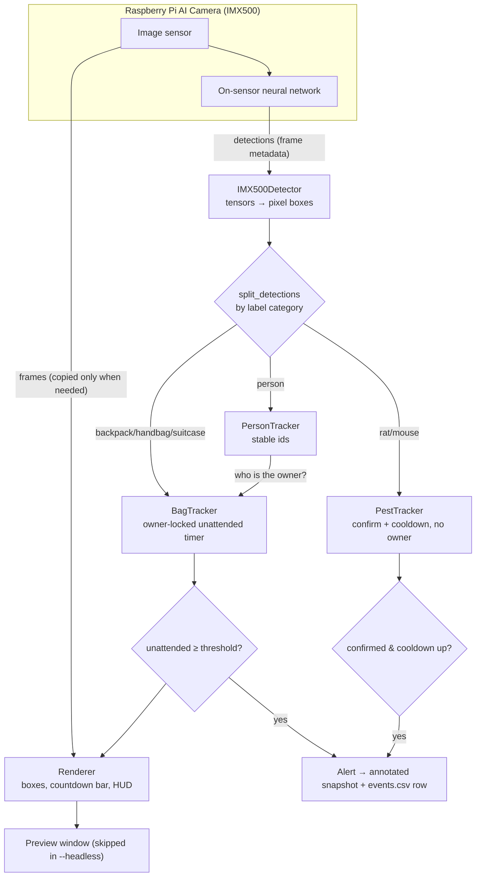

# SecurePi FlowGuard

An edge-AI security monitor for the **Raspberry Pi AI Camera (Sony IMX500)** that
detects **unattended objects** (bags) and **pests** (rodents) — running the
neural network *on the camera sensor itself*.

The repository is split into a lightweight **edge runtime** (what runs on the
Pi) and a separate **training / compilation** side (what runs on a computer or
Google Colab). Model training and `.rpk` compilation are **not** done on the Pi.

> **Hardware-validation status:** the tracking, alerting, pest, preset, and
> compilation-failure logic is covered by an **off-device** test suite. The
> **custom 6-class model has _not_ been validated on a physical IMX500** — see
> [Known model-parser limitations](#known-model-parser-limitations). Nothing in
> this repo should be read as "verified on hardware" unless a test or captured
> artefact demonstrates it.

---

## Overview

- **On-sensor inference.** The IMX500 runs the network; the Pi's CPU only reads
  ready-made detections from the frame metadata, tracks them, and decides when
  to alert. No inference runs on the Pi's CPU.
- **Three independent behaviours** from one detection stream: person tracking,
  unattended-object alerting (owner-aware), and pest alerting (owner-free).
- **Two model options:** the stock COCO SSD/NanoDet network (person + bags), or
  a custom 6-class FlowGuard model that adds rodents (`rat`, `mouse`).
- **Runs headless** for SSH / systemd, or with a live annotated preview.

## Architecture



**Training/compilation** happens elsewhere and only the compiled `.rpk` + labels
are copied to the Pi:

```
Computer / Colab:  dataset_prep → train → export_onnx → compile_imx500  →  .rpk
Raspberry Pi:      load .rpk  →  edge/securePi.py  →  detect + alert
```

## Repository structure

```
SecurePi_FlowGuard/
├── edge/                       # runs ON the Raspberry Pi
│   ├── securePi.py             # the monitor (detector + trackers + alerting)
│   ├── requirements-pi.txt     # lightweight runtime deps (apt-first)
│   ├── presets/                # @<name>.args settings files
│   │   ├── common.args         # shared base (applied automatically)
│   │   ├── demo.args lobby.args kitchen.args carpark.args
│   └── tests/                  # off-device tests (cv2 stubbed)
├── training/                   # runs on a computer / Colab (NOT the Pi)
│   ├── dataset_prep.py verify_dataset.py train.py
│   ├── export_onnx.py compile_imx500.py run_pipeline.py
│   └── requirements-training.txt
├── desktop/                    # optional desktop GUI (YOLO inference preview)
│   ├── app_gui.py
│   └── requirements-desktop.txt
├── models/                     # place the compiled model + labels here
│   ├── labels.txt              # class order (committed)
│   └── README.md               # .rpk placement + parser caveat
├── deploy/
│   ├── securepi.service        # systemd template (headless)
│   └── securepi.env.example    # EnvironmentFile template (no secrets)
├── docs/
│   ├── LABELS.md MODELS.md implementation-plan.md
├── tests/                      # shared / off-device tests (compilation)
├── .gitignore  LICENSE  README.md
```

## Supported classes

The custom FlowGuard model detects six classes, split into three **functional
categories** that drive different logic:

| Category (CLI flag) | Classes | Logic |
|---------------------|---------|-------|
| **person** (`--person-labels`) | `person` | Tracked with stable ids; can become an object's *owner*. |
| **unattended object** (`--unattended-object-labels`, alias `--bag-labels`) | `backpack`, `handbag`, `suitcase` | Owner-aware unattended timer → alert. |
| **pest** (`--pest-labels`) | `rat`, `mouse` | Separate detector: own confidence, confirmation, cooldown; **no owner**. |

> **rat/mouse are pests, never bags.** They must not appear in
> `--unattended-object-labels`. With the *stock* COCO model, `mouse` means a
> *computer mouse* and `rat` is not a class — so pest detection is only
> meaningful with the custom model + `models/labels.txt`.

Custom-model class index order (must match `models/labels.txt`):
`0 person, 1 backpack, 2 handbag, 3 suitcase, 4 rat, 5 mouse`.

### Behaviour

**Person** — matched to stable ids across frames (IoU + centroid, order
independent). Used to associate an *owner* with a nearby object.

**Unattended object** — when an object first appears, a person within
`--proximity` px during the first `--owner-claim-time` seconds is adopted as its
**owner**. Only the owner being near resets the *unattended* timer; bystanders
are ignored, and an object that arrives with no owner can't be claimed. Once
unattended for `--unattended-time` seconds it enters **ALERT**: a snapshot is
saved and a row is appended to `events.csv`. Each object alerts once, then at
most once per `--alert-cooldown` seconds — so one continuously-unattended bag
doesn't spam alerts.

**Pest** — rodents run through a completely separate `PestTracker` with **no
owner association**. A pest is *confirmed* once visible for
`--pest-confirmation-time` seconds **or** seen in `--pest-confirmation-frames`
consecutive frames (either criterion; set one to `0` to disable it), using its
own `--pest-confidence` threshold. A confirmed pest alerts once (logs the
**class** and timestamp, saves a snapshot), then at most once per
`--pest-alert-cooldown` seconds while it stays visible.

### Event log

Every alert appends a row to `runtime/logs/events.csv`:

```
time, event_type, label, confidence, track_id, zone, duration_sec, snapshot
```

`event_type` is `unattended_object` or `pest`; `zone` is the preset tag
(`--zone`). Snapshots are written to `runtime/snapshots/[<zone>/]`.

## Requirements

### Raspberry Pi hardware
- Raspberry Pi 4 / 5 (or Pi Zero 2 W) running **Raspberry Pi OS (Bookworm, 64-bit)**.
- The **Raspberry Pi AI Camera** built on the **Sony IMX500** intelligent vision
  sensor, connected via the CSI ribbon. The IMX500 is required — the network
  runs on the sensor, not the CPU, so an ordinary Pi Camera will not work.
- A microSD card with room for snapshots (capped by `--max-snapshots`).

### Raspberry Pi installation
Install the camera + AI stack via **apt** (recommended over pip so the builds
match the system libcamera/Qt and the IMX500 firmware/models are present):

```bash
sudo apt update
sudo apt install -y python3-picamera2 python3-opencv imx500-all
```

`imx500-all` installs the sensor firmware and the stock models under
`/usr/share/imx500-models/`, including
`imx500_network_ssd_mobilenetv2_fpnlite_320x320_pp.rpk` (COCO). See
[edge/requirements-pi.txt](edge/requirements-pi.txt) for the reference list.

Then, from the repository root on the Pi:

```bash
# Stock COCO model (person + bags only; no pests):
python edge/securePi.py @edge/presets/lobby.args
```

## Training workflow (computer / Colab — not the Pi)

Produces the custom 6-class `.rpk`. **Sony's IMX500 converter needs Python
3.8–3.11** (not 3.12+); Colab's T4 runtime already qualifies.

```bash
python -m pip install -r training/requirements-training.txt

# End-to-end: dataset → train → ONNX → compile
python training/run_pipeline.py --epochs 50 --imgsz 320
# …or run the steps individually:
python training/dataset_prep.py         # download + format (FiftyOne)
python training/verify_dataset.py       # sanity-check box counts per class
python training/train.py                # YOLOv8-n
python training/export_onnx.py          # best.pt → best.onnx
python training/compile_imx500.py       # best.onnx → imx500_custom_securepi.rpk
```

Compilation **fails loudly**: if the converter is missing, exits non-zero with
setup help; it validates the return code, verifies the `.rpk` exists and is
non-empty, and never writes a placeholder. A successful build is **not** proof
of runtime compatibility (see below).

See [docs/implementation-plan.md](docs/implementation-plan.md) for the
step-by-step Colab guide.

## Model deployment workflow

1. Compile off-device (above) to get `imx500_custom_securepi.rpk`.
2. Copy it into `models/` on the Pi (git-ignored; place manually):
   ```bash
   scp ~/Downloads/imx500_custom_securepi.rpk <user>@<pi-host>:~/SecurePi_FlowGuard/models/
   ```
3. Run with the custom model + labels:
   ```bash
   python edge/securePi.py @edge/presets/kitchen.args \
     --model models/imx500_custom_securepi.rpk \
     --labels models/labels.txt \
     --headless
   ```

`.rpk`, `.pt`, and `.onnx` files are **generated separately and never committed**
(git-ignored). See [models/README.md](models/README.md).

## Preset usage

Every run requires a `@<preset>.args` settings file (the script refuses to start
without one, so a camera can't run with unintended defaults). Layering order:
`common.args` (auto) → named preset → command-line flags (later wins).

```bash
python edge/securePi.py @edge/presets/lobby.args      # busy lobby camera
python edge/securePi.py @edge/presets/kitchen.args    # staff kitchen (pests likely)
python edge/securePi.py @edge/presets/demo.args        # fast attended→ALERT cycle (~10s)
```

`@lobby.args` is resolved in `edge/presets/` automatically **from any working
directory** (an explicit or absolute `@path` also works). Model, labels, and
runtime paths resolve the same robust way — a relative `--model models/x.rpk`
is found relative to the repo root regardless of where you launch from.

Preset file format: one flag per line (value on the same line), blank lines
skipped, `#` starts a comment. Add a location by copying a preset and setting
`--zone`.

### Common options

| Flag | Default | Description |
|------|---------|-------------|
| `--model` | stock COCO SSD | IMX500 `.rpk` network |
| `--labels` | *(model built-in)* | Labels file (required for the custom model) |
| `--unattended-time` | `120` | Seconds unattended before an alert |
| `--proximity` | `150` | Max px between object and owner to count as attended |
| `--owner-claim-time` | `3` | Seconds after an object appears to adopt an owner |
| `--stationary-radius` | `120` | Px an object may move and still match its track |
| `--min-confidence` | `0.5` | Min person/object confidence |
| `--pest-labels` | `rat mouse` | Labels handled by pest logic |
| `--pest-confidence` | `0.5` | Separate pest confidence threshold |
| `--pest-confirmation-time` | `2` | Seconds visible to confirm a pest (`0` = frames only) |
| `--pest-confirmation-frames` | `3` | Consecutive frames to confirm a pest (`0` = time only) |
| `--pest-alert-cooldown` | `30` | Seconds between repeat alerts per pest |
| `--zone` | *(none)* | Location tag in the log; groups snapshots |
| `--runtime-dir` | `<repo>/runtime` | Root for snapshots/logs/alerts |
| `--headless` | off | No preview window |
| `--max-snapshots` | `500` | Snapshot cap (protects the SD card) |
| `-v`, `--verbose` | off | Debug logging |

Run `python edge/securePi.py -h` for the full list. Pixel thresholds assume the
default 640×480 frame; scale them if you change the resolution.

## Headless execution

`--headless` skips the preview window and all per-frame annotation except when a
snapshot is actually saved — the cheapest way to run (SSH / systemd):

```bash
python edge/securePi.py @edge/presets/lobby.args --headless
```

### Run as a service

Use the template in [deploy/securepi.service](deploy/securepi.service) with the
EnvironmentFile [deploy/securepi.env.example](deploy/securepi.env.example). It
runs headless as a **non-root** user (in the `video` group), restarts on
failure, and hardcodes no username, path, or secret — all configurable via the
env file. `systemctl stop` sends SIGTERM, which SecurePi handles for a clean
shutdown.

## Cloud integration (FlowGuard) — optional

SecurePi can forward detection events to the FlowGuard backend, which persists
them and notifies FM/security staff over WhatsApp. **The Pi never calls WhatsApp
directly** — it only POSTs authenticated events; FlowGuard owns the WhatsApp
credentials, message formatting, notification status and retries.

- Disabled by default (`FLOWGUARD_EDGE_ENABLED=false`): SecurePi runs **fully
  offline** — local snapshots + `events.csv` work exactly as before, and **no**
  outbox files are created.
- Enable via the env file (`deploy/securepi.env.example`): `FLOWGUARD_EDGE_ENABLED`,
  `FLOWGUARD_API_URL`, `EDGE_INGEST_TOKEN`, `SECUREPI_DEVICE_ID`,
  `SECUREPI_CAMERA_LOCATION`, `SECUREPI_OUTBOX_DIR`. Events POST to
  `<FLOWGUARD_API_URL>/api/edge/detection-alerts` with `Authorization: Bearer
  <EDGE_INGEST_TOKEN>`.
- **Non-blocking + crash-safe:** `edge/flowguard_api.py` runs network I/O on a
  background worker and queues each event as one JSON file in a disk-backed outbox
  (atomic temp-file + rename). Pending events flush on startup and periodically.
  Stdlib `urllib` only — no extra Pi dependency.
- **Idempotent:** a stable `event_id` (`<device>:<type>:<track>:<first-alert-UTC>`)
  is computed once per occurrence and reused on every retry, so a Wi-Fi retry never
  duplicates and never re-notifies.
- **Failure handling:** 200/201 → sent; network/5xx → retried; 401/403 → sending
  halts (fix the token/URL); 400/422 → dead-lettered.

Send a fake event WITHOUT the camera (for local end-to-end checks):

```bash
python edge/send_test_event.py --dry-run --type pest        # print payload only
FLOWGUARD_API_URL=http://localhost:5001 EDGE_INGEST_TOKEN=test-edge-token \
  python edge/send_test_event.py --type pest                 # POST to a backend
```

## Sensor bridge (PIR + ultrasonic) — optional

`edge/sensor_bridge.py` reads the Arduino's JSON serial lines and raises
`RESTRICTED_MOTION` events during restricted hours, reusing the same FlowGuard
client. It owns **only the serial port** (never the IMX500 camera), so it is safe
to run alongside `securePi.py` (see `deploy/securepi-sensor-bridge.service`).
Requires `pyserial`.

- Fires on a motion **transition** (rising edge), never every line; skipped during
  the PIR warm-up; gated to restricted hours (Singapore time, overnight ranges such
  as `22:00–06:00` supported); configurable cooldown.
- `--dry-run` prints the event without sending it.
- The ultrasonic distance rides along as `sensor_metadata` only — it **cannot**
  identify an object class, so no item pick-up/set-down alert is derived from it.

Arduino serial schema — one JSON object per line (~2 Hz), no library:

```json
{"type":"sensor_status","pir_ready":true,"motion":true,"distance_cm":18.4,"object_close":true,"uptime_ms":65432}
```

`distance_cm` is `null` on no echo; `motion` stays `false` during the 30 s PIR
warm-up.

## Testing

Off-device suites — `cv2`/`picamera2` and the network are stubbed or unused, so
they run on any machine, no camera and no cloud required:

```bash
# edge runtime: tracking, matching, alerting, pests, presets
python -m pytest edge/tests/ -q
python edge/tests/test_securepi.py          # also runs standalone

# FlowGuard integration: API client + crash-safe outbox, alert callbacks, sensor bridge
python -m pytest edge/tests/test_flowguard_api.py edge/tests/test_sensor_bridge.py edge/tests/test_securepi_integration.py -q

# training-side: compilation-failure handling
python -m pytest tests/ -q
```

The tests cover, among others: rat/mouse never entering unattended-object
tracking, pest confirmation thresholds and cooldown, pest alert class + logging,
bags still using unattended-object logic, person→owner association, preset
resolution after the reorganisation, and that a compilation failure / absent /
empty `.rpk` is treated as failure (never reported as success).

## Troubleshooting

- **"a settings file is required"** — pass a preset, e.g. `@edge/presets/lobby.args`.
- **"IMX500 support is unavailable"** — you're off-device or the camera stack
  isn't installed: `sudo apt install -y python3-picamera2 imx500-all`.
- **"is not an object-detection network"** — you passed a pose/classification/
  segmentation `.rpk`. Use an object-detection model (see [docs/MODELS.md](docs/MODELS.md)).
- **First run pauses ~30s** — the sensor firmware is uploading (progress bar).
- **No `rat`/`mouse` detections with the stock model** — expected; `rat` isn't a
  COCO class and COCO `mouse` is a computer mouse. Use the custom model.
- **Objects spawn duplicate boxes / merge** — tune `--stationary-radius`.
- **Custom model loads but detections look wrong/empty** — likely the parser
  limitation below.

## Known model-parser limitations

The edge parser (`IMX500Detector.detect`) decodes only **two** output formats:
the SSD "_pp" 3-tensor format and NanoDet. The custom FlowGuard model is a
**YOLOv8** export, whose stock ONNX output is a **single raw tensor** requiring
YOLO-specific decoding + NMS — which is **not implemented** and neither format
matches. **Compiling an `.rpk` successfully does not mean the edge runtime can
read it.**

This is an **open item requiring verification on the physical Raspberry Pi**
(expected tensor format, required metadata, post-processing, label ordering, and
possibly a new YOLO decode branch). Full detail — including exactly what to test
on hardware — is in [docs/MODELS.md](docs/MODELS.md#️-known-model-parser-limitation--the-custom-flowguard-model)
and [models/README.md](models/README.md). Until that passes, treat the custom
model as **unvalidated on hardware**.

## Privacy

The camera captures images of real people and spaces. **Alert snapshots and the
event log are stored locally** under `runtime/` (git-ignored) and are auto-pruned
to `--max-snapshots`.

By default (`FLOWGUARD_EDGE_ENABLED=false`) **nothing leaves the device**. When the
optional FlowGuard integration is enabled, SecurePi additionally sends detection
**event metadata** (zone, camera, alert type, object class, confidence, timestamps,
device id, and the local snapshot *path*) to your FlowGuard backend over an
authenticated HTTPS POST — and queues it in a local outbox while offline. **Snapshot
image files themselves are NOT uploaded** by this software; only the local path is
sent, and FlowGuard never presents that path as a remotely reachable link.

If you deploy this, you are responsible for signage/consent and for securing or
purging `runtime/` (and any FlowGuard-side storage) per your local laws and
policies. Do not commit captured images or logs to version control.

## License

[MIT](LICENSE).
